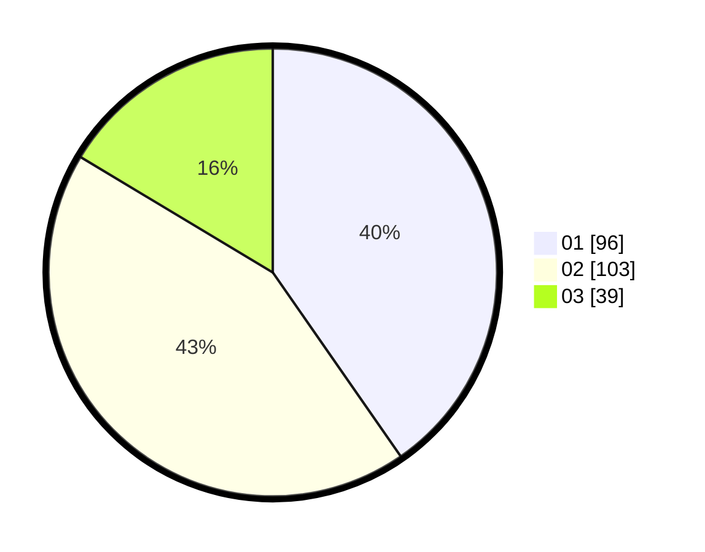

# Hasil

Hasil perolehan suara paslon dapat dilihat pada file paslon-01.txt, paslon-02.txt, dan paslon-03.txt.

Jika tidak ada, artinya data tersebut belum ada pada SIREKAP.

## Perolehan Suara

 * Paslon 01: **96**.
 * Paslon 02: **103**.
 * Paslon 03: **39**.

## Foto C Plano

https://sirekap-obj-formc.kpu.go.id/19f4/pemilu/ppwp/31/74/10/10/02/3174101002171-20240216-062538--690e8b6c-34f5-436d-b7d1-fb9aec82e07d.jpg

https://sirekap-obj-formc.kpu.go.id/19f4/pemilu/ppwp/31/74/10/10/02/3174101002171-20240216-053436--3031ba88-4a9b-42c2-805f-f828d0e3aa6e.jpg

https://sirekap-obj-formc.kpu.go.id/19f4/pemilu/ppwp/31/74/10/10/02/3174101002171-20240216-062540--8c7a31d2-7854-44d1-88e5-0a8b22b4ca42.jpg

## DATA PEMILIH TETAP

Jumlah pemilih dalam DPT: **286**.
 * L: **139**.
 * P: **147**.

## DATA PENGGUNA HAK PILIH

Jumlah pengguna hak pilih dalam DPT: **235**.
 * L: **109**.
 * P: **126**.

Jumlah pengguna hak pilih dalam DPTb: **6**.
 * L: **2**.
 * P: **4**.

Jumlah pengguna hak pilih dalam DPK: **0**.
 * L: **0**.
 * P: **0**.

Jumlah pengguna hak pilih: **241**.
 * L: **111**.
 * P: **130**.

## JUMLAH SUARA SAH DAN TIDAK SAH

JUMLAH SELURUH SUARA SAH: **238**.

JUMLAH SUARA TIDAK SAH: **3**.

JUMLAH SELURUH SUARA SAH DAN SUARA TIDAK SAH: **241**.
