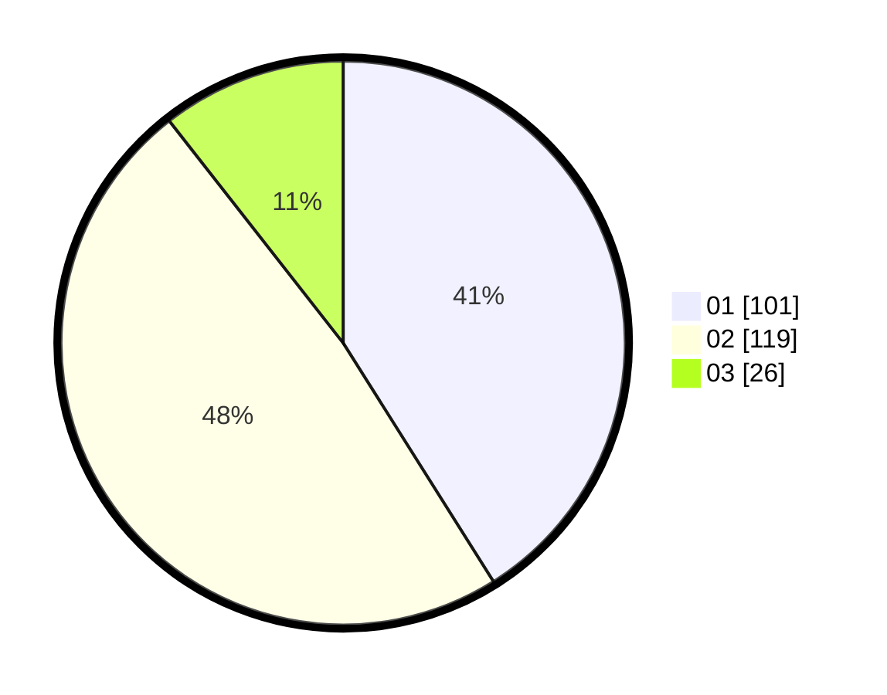

# Hasil

Hasil perolehan suara paslon dapat dilihat pada file paslon-01.txt, paslon-02.txt, dan paslon-03.txt.

Jika tidak ada, artinya data tersebut belum ada pada SIREKAP.

## Perolehan Suara

 * Paslon 01: **101**.
 * Paslon 02: **119**.
 * Paslon 03: **26**.

## Foto C Plano

https://sirekap-obj-formc.kpu.go.id/ea1d/pemilu/ppwp/31/74/10/10/02/3174101002178-20240216-210428--13331dc6-363e-4473-90e2-2f14c5f6fef3.jpg

https://sirekap-obj-formc.kpu.go.id/ea1d/pemilu/ppwp/31/74/10/10/02/3174101002178-20240216-210429--deefa01b-92a2-43b5-8f5a-72826ebf238d.jpg

https://sirekap-obj-formc.kpu.go.id/ea1d/pemilu/ppwp/31/74/10/10/02/3174101002178-20240216-210428--fd34a36a-7d1d-4685-9116-7be7f0ef3054.jpg

## DATA PEMILIH TETAP

Jumlah pemilih dalam DPT: **291**.
 * L: **154**.
 * P: **137**.

## DATA PENGGUNA HAK PILIH

Jumlah pengguna hak pilih dalam DPT: **243**.
 * L: **124**.
 * P: **119**.

Jumlah pengguna hak pilih dalam DPTb: **1**.
 * L: **1**.
 * P: **0**.

Jumlah pengguna hak pilih dalam DPK: **3**.
 * L: **1**.
 * P: **2**.

Jumlah pengguna hak pilih: **247**.
 * L: **126**.
 * P: **121**.

## JUMLAH SUARA SAH DAN TIDAK SAH

JUMLAH SELURUH SUARA SAH: **246**.

JUMLAH SUARA TIDAK SAH: **1**.

JUMLAH SELURUH SUARA SAH DAN SUARA TIDAK SAH: **247**.
