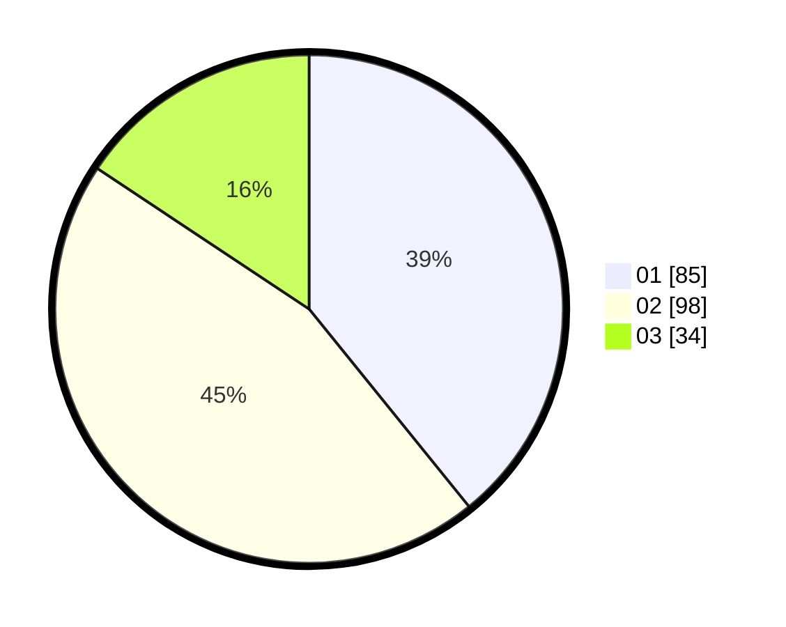

# Hasil

Hasil perolehan suara paslon dapat dilihat pada file paslon-01.txt, paslon-02.txt, dan paslon-03.txt.

Jika tidak ada, artinya data tersebut belum ada pada SIREKAP.

## Perolehan Suara

 * Paslon 01: **85**.
 * Paslon 02: **98**.
 * Paslon 03: **34**.

## Foto C Plano

https://sirekap-obj-formc.kpu.go.id/9b03/pemilu/ppwp/31/74/10/10/03/3174101003006-20240214-190859--233bebbd-ac3b-4ade-b0a2-b2180ebd696f.jpg

https://sirekap-obj-formc.kpu.go.id/9b03/pemilu/ppwp/31/74/10/10/03/3174101003006-20240214-192641--c8cb6aa2-52ef-4d37-8da7-a041a51a1f10.jpg

https://sirekap-obj-formc.kpu.go.id/9b03/pemilu/ppwp/31/74/10/10/03/3174101003006-20240214-190954--616a6f47-5065-4ae5-a69f-d49ebacc685d.jpg

## DATA PEMILIH TETAP

Jumlah pemilih dalam DPT: **269**.
 * L: **139**.
 * P: **130**.

## DATA PENGGUNA HAK PILIH

Jumlah pengguna hak pilih dalam DPT: **214**.
 * L: **105**.
 * P: **109**.

Jumlah pengguna hak pilih dalam DPTb: **2**.
 * L: **1**.
 * P: **1**.

Jumlah pengguna hak pilih dalam DPK: **4**.
 * L: **2**.
 * P: **2**.

Jumlah pengguna hak pilih: **220**.
 * L: **108**.
 * P: **112**.

## JUMLAH SUARA SAH DAN TIDAK SAH

JUMLAH SELURUH SUARA SAH: **217**.

JUMLAH SUARA TIDAK SAH: **3**.

JUMLAH SELURUH SUARA SAH DAN SUARA TIDAK SAH: **220**.
