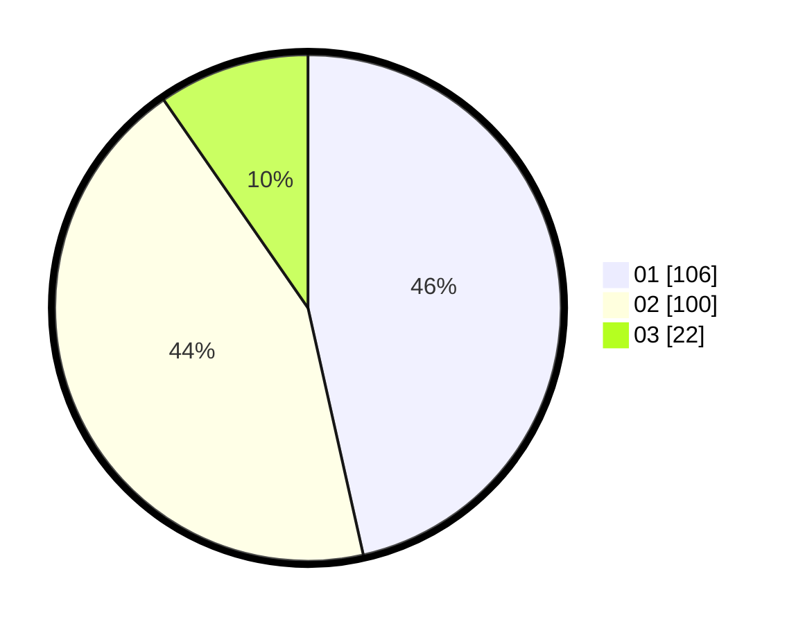

# Hasil

Hasil perolehan suara paslon dapat dilihat pada file paslon-01.txt, paslon-02.txt, dan paslon-03.txt.

Jika tidak ada, artinya data tersebut belum ada pada SIREKAP.

## Perolehan Suara

 * Paslon 01: **106**.
 * Paslon 02: **100**.
 * Paslon 03: **22**.

## Foto C Plano

https://sirekap-obj-formc.kpu.go.id/d3dd/pemilu/ppwp/31/74/10/10/03/3174101003008-20240218-132627--c438260d-d86d-49de-89a2-fa3f2e884eb5.jpg

https://sirekap-obj-formc.kpu.go.id/d3dd/pemilu/ppwp/31/74/10/10/03/3174101003008-20240218-132754--d0cd9968-3619-4da0-8ed9-4e0b5f58c81b.jpg

https://sirekap-obj-formc.kpu.go.id/d3dd/pemilu/ppwp/31/74/10/10/03/3174101003008-20240218-132917--757f51a5-e68e-4fac-9412-afe8f0b163f9.jpg

## DATA PEMILIH TETAP

Jumlah pemilih dalam DPT: **286**.
 * L: **147**.
 * P: **139**.

## DATA PENGGUNA HAK PILIH

Jumlah pengguna hak pilih dalam DPT: **230**.
 * L: **115**.
 * P: **115**.

Jumlah pengguna hak pilih dalam DPTb: **0**.
 * L: **0**.
 * P: **0**.

Jumlah pengguna hak pilih dalam DPK: **3**.
 * L: **1**.
 * P: **2**.

Jumlah pengguna hak pilih: **233**.
 * L: **116**.
 * P: **117**.

## JUMLAH SUARA SAH DAN TIDAK SAH

JUMLAH SELURUH SUARA SAH: **228**.

JUMLAH SUARA TIDAK SAH: **5**.

JUMLAH SELURUH SUARA SAH DAN SUARA TIDAK SAH: **233**.
