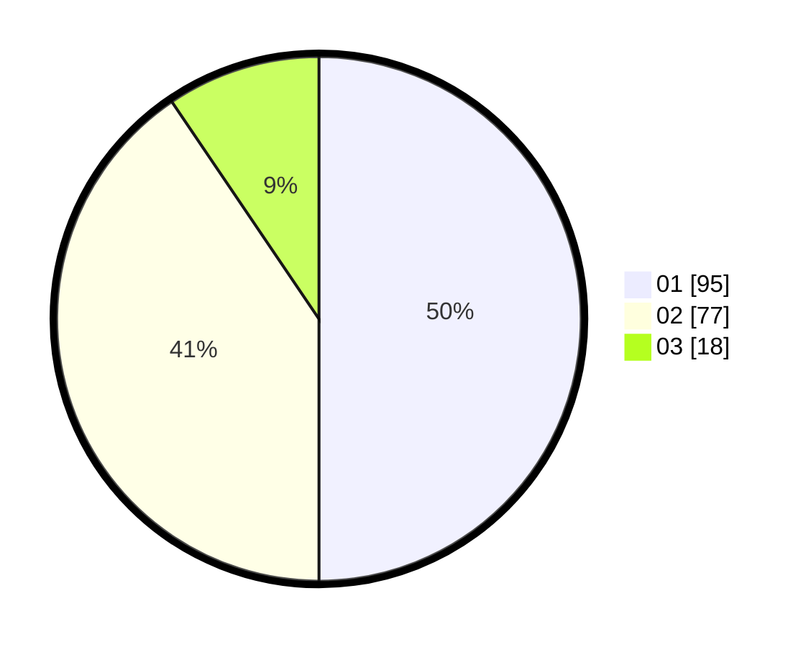

# Hasil

Hasil perolehan suara paslon dapat dilihat pada file paslon-01.txt, paslon-02.txt, dan paslon-03.txt.

Jika tidak ada, artinya data tersebut belum ada pada SIREKAP.

## Perolehan Suara

 * Paslon 01: **95**.
 * Paslon 02: **77**.
 * Paslon 03: **18**.

## Foto C Plano

https://sirekap-obj-formc.kpu.go.id/86c3/pemilu/ppwp/31/74/10/10/03/3174101003018-20240214-223825--33d0f8df-c75e-4b94-807b-e2a5a2a16cf6.jpg

https://sirekap-obj-formc.kpu.go.id/86c3/pemilu/ppwp/31/74/10/10/03/3174101003018-20240214-230139--085bbea2-e285-49bf-a882-3d9068d306aa.jpg

https://sirekap-obj-formc.kpu.go.id/86c3/pemilu/ppwp/31/74/10/10/03/3174101003018-20240214-230324--2230bd12-d547-43e2-b55d-901d245955fd.jpg
