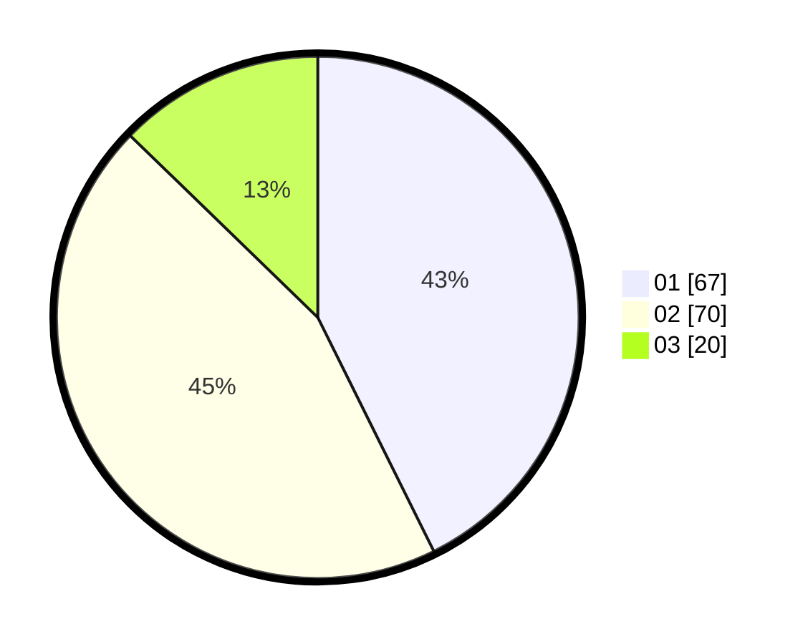

# Hasil

Hasil perolehan suara paslon dapat dilihat pada file paslon-01.txt, paslon-02.txt, dan paslon-03.txt.

Jika tidak ada, artinya data tersebut belum ada pada SIREKAP.

## Perolehan Suara

 * Paslon 01: **67**.
 * Paslon 02: **70**.
 * Paslon 03: **20**.

## Foto C Plano

https://sirekap-obj-formc.kpu.go.id/8d7e/pemilu/ppwp/31/74/10/10/03/3174101003020-20240218-112724--ff5d6bbf-c160-47dd-8f00-a6f40ff6f4b1.jpg

https://sirekap-obj-formc.kpu.go.id/8d7e/pemilu/ppwp/31/74/10/10/03/3174101003020-20240218-113014--632be9ab-4f06-4e38-8e6a-c6387dbb7210.jpg

https://sirekap-obj-formc.kpu.go.id/8d7e/pemilu/ppwp/31/74/10/10/03/3174101003020-20240218-113113--a6075e9c-c32f-4beb-b430-b85387adb04e.jpg

## DATA PEMILIH TETAP

Jumlah pemilih dalam DPT: **204**.
 * L: **95**.
 * P: **109**.

## DATA PENGGUNA HAK PILIH

Jumlah pengguna hak pilih dalam DPT: **153**.
 * L: **70**.
 * P: **83**.

Jumlah pengguna hak pilih dalam DPTb: **4**.
 * L: **0**.
 * P: **4**.

Jumlah pengguna hak pilih dalam DPK: **1**.
 * L: **1**.
 * P: **0**.

Jumlah pengguna hak pilih: **158**.
 * L: **71**.
 * P: **87**.

## JUMLAH SUARA SAH DAN TIDAK SAH

JUMLAH SELURUH SUARA SAH: **157**.

JUMLAH SUARA TIDAK SAH: **1**.

JUMLAH SELURUH SUARA SAH DAN SUARA TIDAK SAH: **158**.
