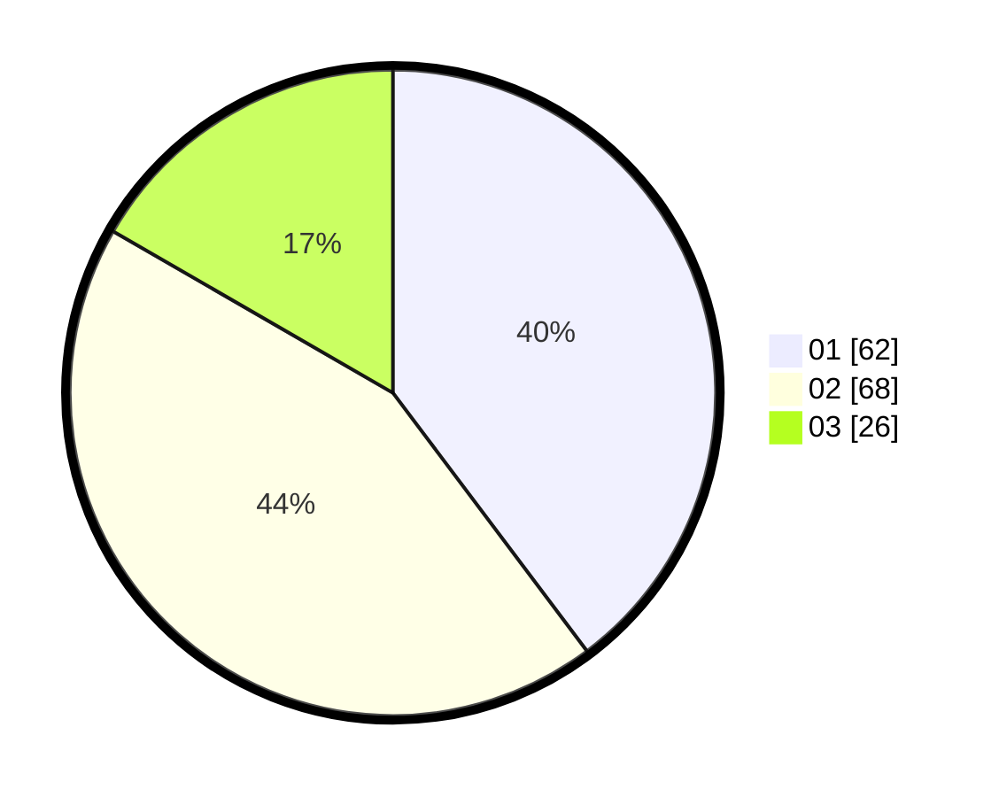

# Hasil

Hasil perolehan suara paslon dapat dilihat pada file paslon-01.txt, paslon-02.txt, dan paslon-03.txt.

Jika tidak ada, artinya data tersebut belum ada pada SIREKAP.

## Perolehan Suara

 * Paslon 01: **62**.
 * Paslon 02: **68**.
 * Paslon 03: **26**.

## Foto C Plano

https://sirekap-obj-formc.kpu.go.id/23eb/pemilu/ppwp/31/74/10/10/03/3174101003021-20240214-225330--42ff2843-7802-419a-9792-e8f9cf27cf54.jpg

https://sirekap-obj-formc.kpu.go.id/23eb/pemilu/ppwp/31/74/10/10/03/3174101003021-20240214-221720--4c5c520c-57de-463a-bfd2-ed900463bab1.jpg

https://sirekap-obj-formc.kpu.go.id/23eb/pemilu/ppwp/31/74/10/10/03/3174101003021-20240214-222002--31bb2904-212c-4b56-9dea-be44a496187f.jpg
