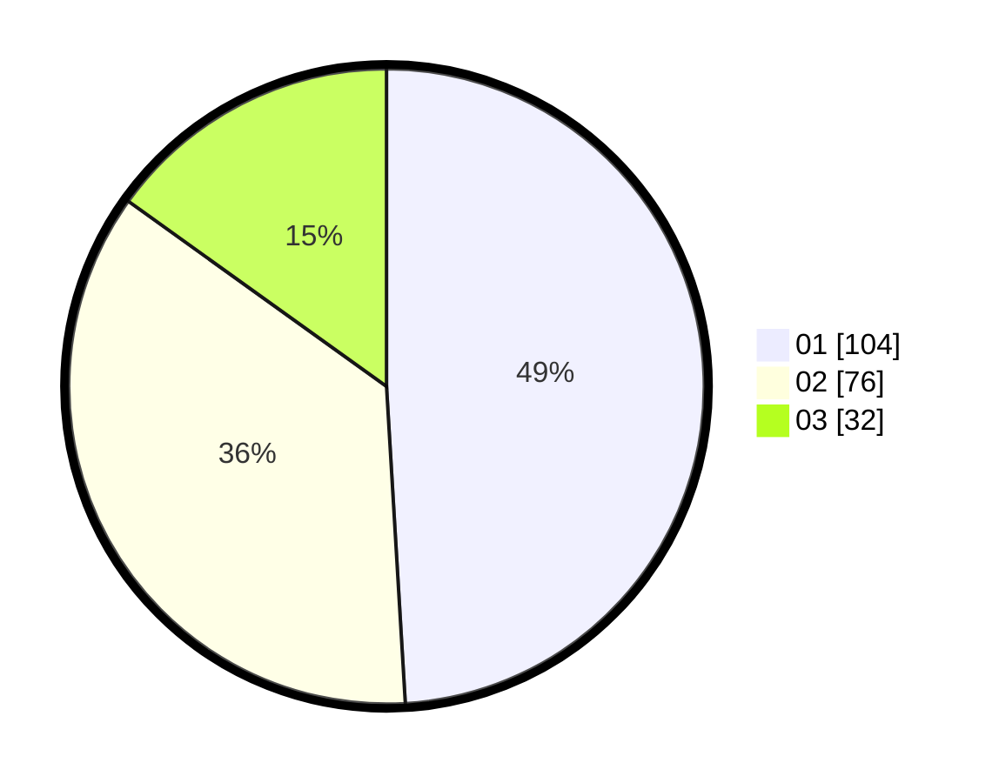

# Hasil

Hasil perolehan suara paslon dapat dilihat pada file paslon-01.txt, paslon-02.txt, dan paslon-03.txt.

Jika tidak ada, artinya data tersebut belum ada pada SIREKAP.

## Perolehan Suara

 * Paslon 01: **104**.
 * Paslon 02: **76**.
 * Paslon 03: **32**.

## Foto C Plano

https://sirekap-obj-formc.kpu.go.id/09e5/pemilu/ppwp/31/74/10/10/03/3174101003022-20240218-133629--666e3be5-f735-4bde-8243-5047e1d99643.jpg

https://sirekap-obj-formc.kpu.go.id/09e5/pemilu/ppwp/31/74/10/10/03/3174101003022-20240218-133829--f9c4c39c-7e33-4a12-9ac6-ebdebd0d01f7.jpg

https://sirekap-obj-formc.kpu.go.id/09e5/pemilu/ppwp/31/74/10/10/03/3174101003022-20240218-133929--e7e7778d-2212-4b1e-996e-572579059871.jpg

## DATA PEMILIH TETAP

Jumlah pemilih dalam DPT: **274**.
 * L: **137**.
 * P: **137**.

## DATA PENGGUNA HAK PILIH

Jumlah pengguna hak pilih dalam DPT: **217**.
 * L: **113**.
 * P: **104**.

Jumlah pengguna hak pilih dalam DPTb: **0**.
 * L: **0**.
 * P: **0**.

Jumlah pengguna hak pilih dalam DPK: **1**.
 * L: **0**.
 * P: **1**.

Jumlah pengguna hak pilih: **218**.
 * L: **113**.
 * P: **105**.

## JUMLAH SUARA SAH DAN TIDAK SAH

JUMLAH SELURUH SUARA SAH: **212**.

JUMLAH SUARA TIDAK SAH: **6**.

JUMLAH SELURUH SUARA SAH DAN SUARA TIDAK SAH: **218**.
