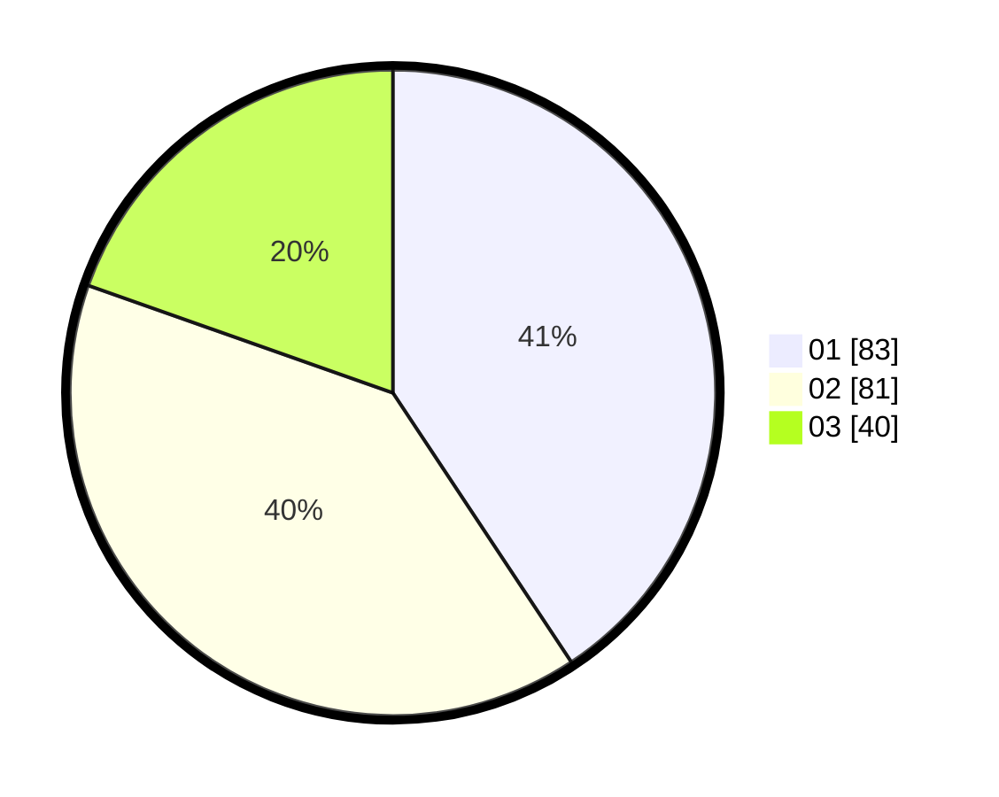

# Hasil

Hasil perolehan suara paslon dapat dilihat pada file paslon-01.txt, paslon-02.txt, dan paslon-03.txt.

Jika tidak ada, artinya data tersebut belum ada pada SIREKAP.

## Perolehan Suara

 * Paslon 01: **83**.
 * Paslon 02: **81**.
 * Paslon 03: **40**.

## Foto C Plano

https://sirekap-obj-formc.kpu.go.id/34a5/pemilu/ppwp/31/74/10/10/03/3174101003027-20240218-140343--6a138125-c28c-4f34-aa5f-1b38e22124b8.jpg

https://sirekap-obj-formc.kpu.go.id/34a5/pemilu/ppwp/31/74/10/10/03/3174101003027-20240218-140559--1937b22d-fb90-45e7-99eb-59d8c2d57d2d.jpg

https://sirekap-obj-formc.kpu.go.id/34a5/pemilu/ppwp/31/74/10/10/03/3174101003027-20240218-140750--2939a732-2d9f-4f98-9fa9-63de76b2e8fb.jpg

## DATA PEMILIH TETAP

Jumlah pemilih dalam DPT: **268**.
 * L: **127**.
 * P: **141**.

## DATA PENGGUNA HAK PILIH

Jumlah pengguna hak pilih dalam DPT: **206**.
 * L: **93**.
 * P: **113**.

Jumlah pengguna hak pilih dalam DPTb: **0**.
 * L: **0**.
 * P: **0**.

Jumlah pengguna hak pilih dalam DPK: **2**.
 * L: **1**.
 * P: **1**.

Jumlah pengguna hak pilih: **208**.
 * L: **94**.
 * P: **114**.

## JUMLAH SUARA SAH DAN TIDAK SAH

JUMLAH SELURUH SUARA SAH: **204**.

JUMLAH SUARA TIDAK SAH: **4**.

JUMLAH SELURUH SUARA SAH DAN SUARA TIDAK SAH: **208**.
