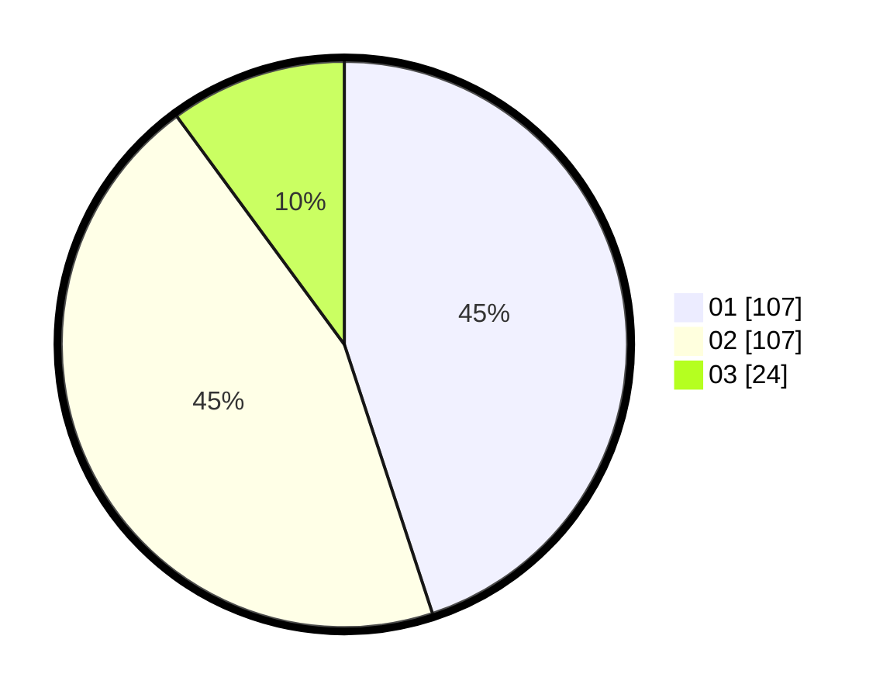

# Hasil

Hasil perolehan suara paslon dapat dilihat pada file paslon-01.txt, paslon-02.txt, dan paslon-03.txt.

Jika tidak ada, artinya data tersebut belum ada pada SIREKAP.

## Perolehan Suara

 * Paslon 01: **107**.
 * Paslon 02: **107**.
 * Paslon 03: **24**.

## Foto C Plano

https://sirekap-obj-formc.kpu.go.id/3589/pemilu/ppwp/31/74/10/10/03/3174101003028-20240218-110953--81f9f64e-4d68-451c-9e7a-223f3a053bed.jpg

https://sirekap-obj-formc.kpu.go.id/3589/pemilu/ppwp/31/74/10/10/03/3174101003028-20240218-111151--4547425a-a086-4090-a45f-58d2daef1ed2.jpg

https://sirekap-obj-formc.kpu.go.id/3589/pemilu/ppwp/31/74/10/10/03/3174101003028-20240218-111337--3bb80eec-b658-475f-9059-709d5d7389cf.jpg

## DATA PEMILIH TETAP

Jumlah pemilih dalam DPT: **270**.
 * L: **137**.
 * P: **133**.

## DATA PENGGUNA HAK PILIH

Jumlah pengguna hak pilih dalam DPT: **242**.
 * L: **118**.
 * P: **124**.

Jumlah pengguna hak pilih dalam DPTb: **0**.
 * L: **0**.
 * P: **0**.

Jumlah pengguna hak pilih dalam DPK: **0**.
 * L: **1**.
 * P: **0**.

Jumlah pengguna hak pilih: **243**.
 * L: **119**.
 * P: **124**.

## JUMLAH SUARA SAH DAN TIDAK SAH

JUMLAH SELURUH SUARA SAH: **238**.

JUMLAH SUARA TIDAK SAH: **5**.

JUMLAH SELURUH SUARA SAH DAN SUARA TIDAK SAH: **243**.
