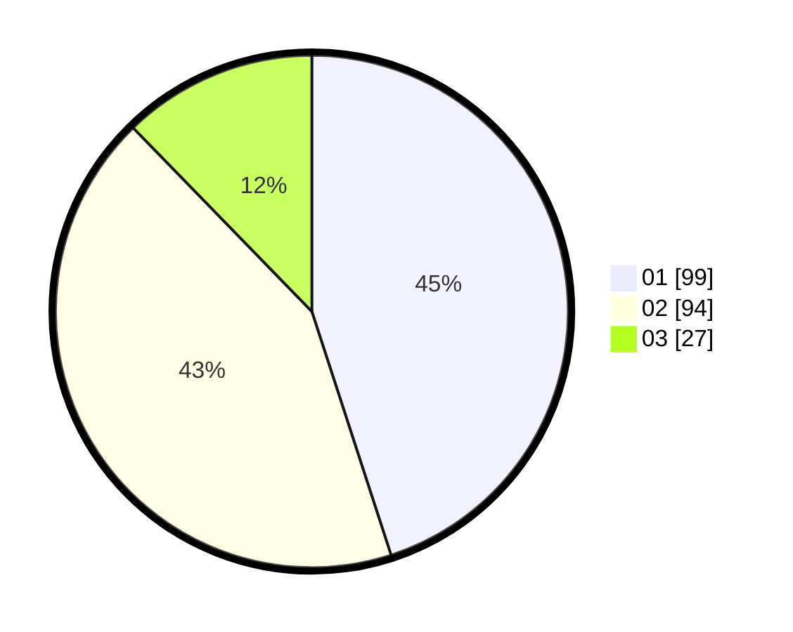

# Hasil

Hasil perolehan suara paslon dapat dilihat pada file paslon-01.txt, paslon-02.txt, dan paslon-03.txt.

Jika tidak ada, artinya data tersebut belum ada pada SIREKAP.

## Perolehan Suara

 * Paslon 01: **99**.
 * Paslon 02: **94**.
 * Paslon 03: **27**.

## Foto C Plano

https://sirekap-obj-formc.kpu.go.id/55c2/pemilu/ppwp/31/74/10/10/03/3174101003029-20240218-111749--63e74f27-91af-4cc0-8f59-31575c44a00c.jpg

https://sirekap-obj-formc.kpu.go.id/55c2/pemilu/ppwp/31/74/10/10/03/3174101003029-20240218-112020--edfa2734-c63c-47aa-bc30-524f1d43046c.jpg

https://sirekap-obj-formc.kpu.go.id/55c2/pemilu/ppwp/31/74/10/10/03/3174101003029-20240218-112249--edfab380-e07c-48d3-b036-19812cfe4dda.jpg

## DATA PEMILIH TETAP

Jumlah pemilih dalam DPT: **267**.
 * L: **130**.
 * P: **137**.

## DATA PENGGUNA HAK PILIH

Jumlah pengguna hak pilih dalam DPT: **223**.
 * L: **111**.
 * P: **112**.

Jumlah pengguna hak pilih dalam DPTb: **0**.
 * L: **0**.
 * P: **0**.

Jumlah pengguna hak pilih dalam DPK: **0**.
 * L: **0**.
 * P: **0**.

Jumlah pengguna hak pilih: **223**.
 * L: **111**.
 * P: **112**.

## JUMLAH SUARA SAH DAN TIDAK SAH

JUMLAH SELURUH SUARA SAH: **220**.

JUMLAH SUARA TIDAK SAH: **3**.

JUMLAH SELURUH SUARA SAH DAN SUARA TIDAK SAH: **223**.
