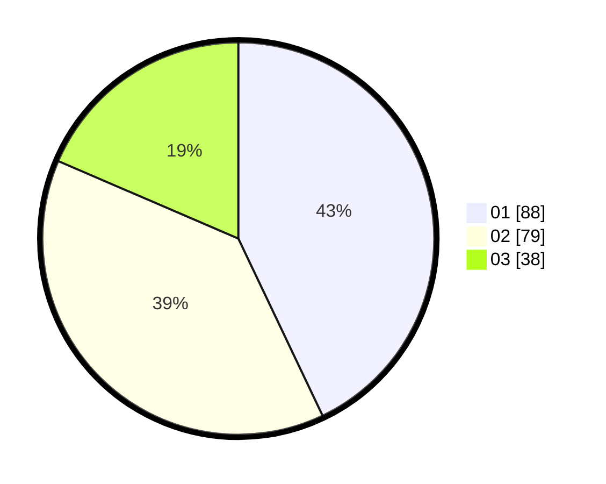

# Hasil

Hasil perolehan suara paslon dapat dilihat pada file paslon-01.txt, paslon-02.txt, dan paslon-03.txt.

Jika tidak ada, artinya data tersebut belum ada pada SIREKAP.

## Perolehan Suara

 * Paslon 01: **88**.
 * Paslon 02: **79**.
 * Paslon 03: **38**.

## Foto C Plano

https://sirekap-obj-formc.kpu.go.id/d513/pemilu/ppwp/31/74/10/10/03/3174101003032-20240218-114347--bba0dbc2-79e5-4185-8829-5ef3814f379e.jpg

https://sirekap-obj-formc.kpu.go.id/d513/pemilu/ppwp/31/74/10/10/03/3174101003032-20240218-114439--f459c234-f8a0-4892-b2d7-e4f81f5246c4.jpg

https://sirekap-obj-formc.kpu.go.id/d513/pemilu/ppwp/31/74/10/10/03/3174101003032-20240218-114558--18aa059a-5189-4662-b49b-76b16a6b2992.jpg

## DATA PEMILIH TETAP

Jumlah pemilih dalam DPT: **239**.
 * L: **117**.
 * P: **122**.

## DATA PENGGUNA HAK PILIH

Jumlah pengguna hak pilih dalam DPT: **207**.
 * L: **101**.
 * P: **106**.

Jumlah pengguna hak pilih dalam DPTb: **1**.
 * L: **1**.
 * P: **0**.

Jumlah pengguna hak pilih dalam DPK: **3**.
 * L: **2**.
 * P: **1**.

Jumlah pengguna hak pilih: **211**.
 * L: **104**.
 * P: **107**.

## JUMLAH SUARA SAH DAN TIDAK SAH

JUMLAH SELURUH SUARA SAH: **205**.

JUMLAH SUARA TIDAK SAH: **6**.

JUMLAH SELURUH SUARA SAH DAN SUARA TIDAK SAH: **211**.
