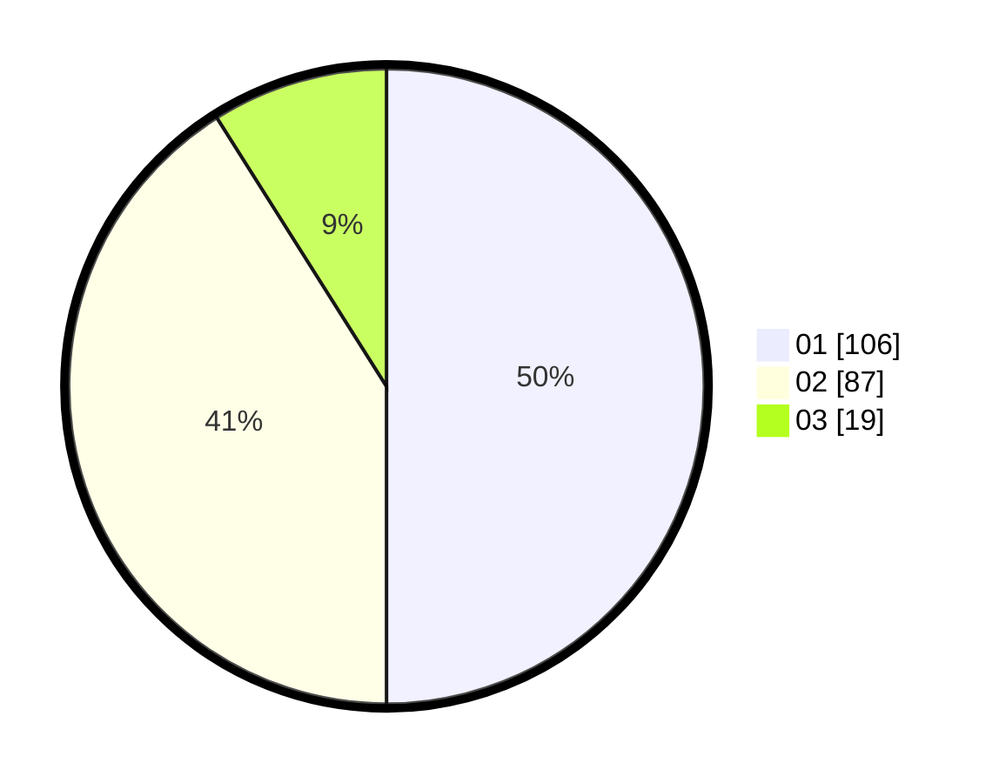

# Hasil

Hasil perolehan suara paslon dapat dilihat pada file paslon-01.txt, paslon-02.txt, dan paslon-03.txt.

Jika tidak ada, artinya data tersebut belum ada pada SIREKAP.

## Perolehan Suara

 * Paslon 01: **106**.
 * Paslon 02: **87**.
 * Paslon 03: **19**.

## Foto C Plano

https://sirekap-obj-formc.kpu.go.id/10a2/pemilu/ppwp/31/74/10/10/03/3174101003046-20240215-113453--452bcd30-da0d-4d57-97d7-ed72db238de3.jpg

https://sirekap-obj-formc.kpu.go.id/10a2/pemilu/ppwp/31/74/10/10/03/3174101003046-20240215-113514--33fa4a06-e65d-47e3-87df-19cfcb770a71.jpg

https://sirekap-obj-formc.kpu.go.id/10a2/pemilu/ppwp/31/74/10/10/03/3174101003046-20240215-113503--829cf866-7fee-4839-b6cd-db341ec9f9fe.jpg

## DATA PEMILIH TETAP

Jumlah pemilih dalam DPT: **269**.
 * L: **132**.
 * P: **137**.

## DATA PENGGUNA HAK PILIH

Jumlah pengguna hak pilih dalam DPT: **212**.
 * L: **104**.
 * P: **108**.

Jumlah pengguna hak pilih dalam DPTb: **4**.
 * L: **2**.
 * P: **2**.

Jumlah pengguna hak pilih dalam DPK: **1**.
 * L: **0**.
 * P: **1**.

Jumlah pengguna hak pilih: **217**.
 * L: **106**.
 * P: **111**.

## JUMLAH SUARA SAH DAN TIDAK SAH

JUMLAH SELURUH SUARA SAH: **212**.

JUMLAH SUARA TIDAK SAH: **5**.

JUMLAH SELURUH SUARA SAH DAN SUARA TIDAK SAH: **217**.
