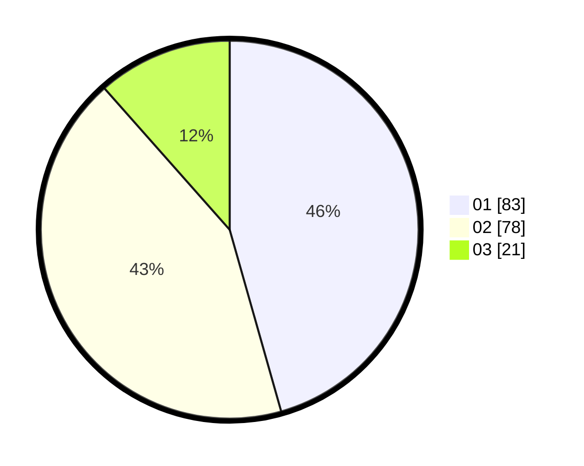

# Hasil

Hasil perolehan suara paslon dapat dilihat pada file paslon-01.txt, paslon-02.txt, dan paslon-03.txt.

Jika tidak ada, artinya data tersebut belum ada pada SIREKAP.

## Perolehan Suara

 * Paslon 01: **83**.
 * Paslon 02: **78**.
 * Paslon 03: **21**.

## Foto C Plano

https://sirekap-obj-formc.kpu.go.id/5924/pemilu/ppwp/31/74/10/10/03/3174101003052-20240214-191344--de9a7f21-9b69-4578-93d1-9880fc180308.jpg

https://sirekap-obj-formc.kpu.go.id/5924/pemilu/ppwp/31/74/10/10/03/3174101003052-20240214-191348--563d56db-a6a2-4c23-89a0-85bb3b97b93a.jpg

https://sirekap-obj-formc.kpu.go.id/5924/pemilu/ppwp/31/74/10/10/03/3174101003052-20240214-191354--1be0a09e-0026-4353-9f7a-1853b65344ee.jpg

## DATA PEMILIH TETAP

Jumlah pemilih dalam DPT: **244**.
 * L: **125**.
 * P: **119**.

## DATA PENGGUNA HAK PILIH

Jumlah pengguna hak pilih dalam DPT: **180**.
 * L: **90**.
 * P: **90**.

Jumlah pengguna hak pilih dalam DPTb: **2**.
 * L: **0**.
 * P: **2**.

Jumlah pengguna hak pilih dalam DPK: **2**.
 * L: **1**.
 * P: **1**.

Jumlah pengguna hak pilih: **184**.
 * L: **91**.
 * P: **93**.

## JUMLAH SUARA SAH DAN TIDAK SAH

JUMLAH SELURUH SUARA SAH: **182**.

JUMLAH SUARA TIDAK SAH: **2**.

JUMLAH SELURUH SUARA SAH DAN SUARA TIDAK SAH: **184**.
