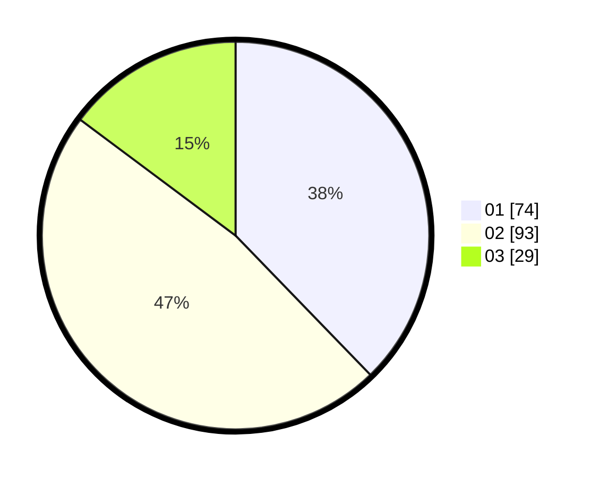

# Hasil

Hasil perolehan suara paslon dapat dilihat pada file paslon-01.txt, paslon-02.txt, dan paslon-03.txt.

Jika tidak ada, artinya data tersebut belum ada pada SIREKAP.

## Perolehan Suara

 * Paslon 01: **74**.
 * Paslon 02: **93**.
 * Paslon 03: **29**.

## Foto C Plano

https://sirekap-obj-formc.kpu.go.id/7abf/pemilu/ppwp/31/74/10/10/03/3174101003053-20240216-144441--4c209862-d297-48d6-b91a-ca4c5e6361dc.jpg

https://sirekap-obj-formc.kpu.go.id/7abf/pemilu/ppwp/31/74/10/10/03/3174101003053-20240216-144443--a4680119-15af-4099-ae5f-b5b7b0409825.jpg

https://sirekap-obj-formc.kpu.go.id/7abf/pemilu/ppwp/31/74/10/10/03/3174101003053-20240216-144442--99b12843-8e17-4ec5-ae32-ddf7020edac1.jpg

## DATA PEMILIH TETAP

Jumlah pemilih dalam DPT: **226**.
 * L: **117**.
 * P: **109**.

## DATA PENGGUNA HAK PILIH

Jumlah pengguna hak pilih dalam DPT: **190**.
 * L: **96**.
 * P: **94**.

Jumlah pengguna hak pilih dalam DPTb: **7**.
 * L: **4**.
 * P: **3**.

Jumlah pengguna hak pilih dalam DPK: **0**.
 * L: **0**.
 * P: **0**.

Jumlah pengguna hak pilih: **197**.
 * L: **100**.
 * P: **97**.

## JUMLAH SUARA SAH DAN TIDAK SAH

JUMLAH SELURUH SUARA SAH: **196**.

JUMLAH SUARA TIDAK SAH: **1**.

JUMLAH SELURUH SUARA SAH DAN SUARA TIDAK SAH: **197**.
