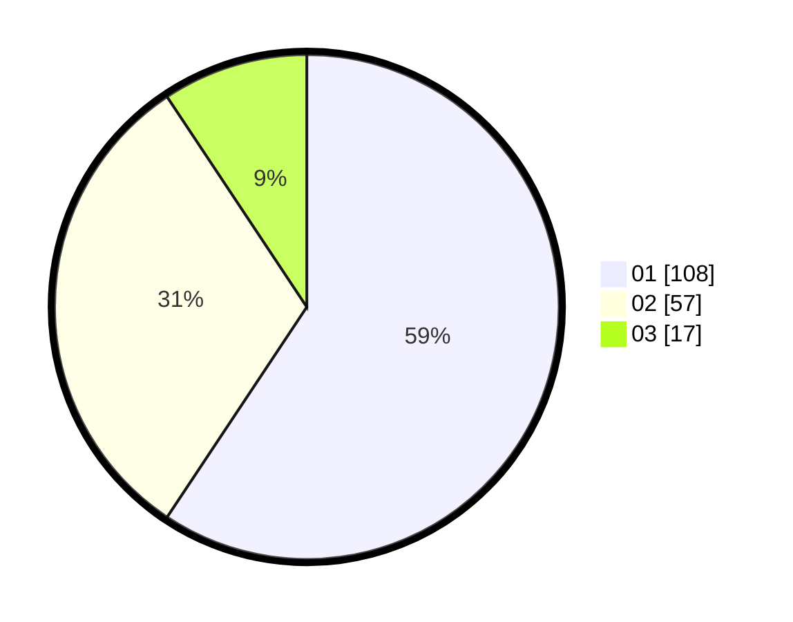

# Hasil

Hasil perolehan suara paslon dapat dilihat pada file paslon-01.txt, paslon-02.txt, dan paslon-03.txt.

Jika tidak ada, artinya data tersebut belum ada pada SIREKAP.

## Perolehan Suara

 * Paslon 01: **108**.
 * Paslon 02: **57**.
 * Paslon 03: **17**.

## Foto C Plano

https://sirekap-obj-formc.kpu.go.id/c170/pemilu/ppwp/31/74/10/10/03/3174101003054-20240216-211147--92966d59-e88d-4d0a-b030-2ccdf9b0feaf.jpg

https://sirekap-obj-formc.kpu.go.id/c170/pemilu/ppwp/31/74/10/10/03/3174101003054-20240216-211148--06553bf7-06c1-43a8-b25a-e2ed1e5459a4.jpg

https://sirekap-obj-formc.kpu.go.id/c170/pemilu/ppwp/31/74/10/10/03/3174101003054-20240216-211147--025ac6e0-0716-400c-851c-3f53704c7f51.jpg

## DATA PEMILIH TETAP

Jumlah pemilih dalam DPT: **225**.
 * L: **107**.
 * P: **118**.

## DATA PENGGUNA HAK PILIH

Jumlah pengguna hak pilih dalam DPT: **183**.
 * L: **82**.
 * P: **101**.

Jumlah pengguna hak pilih dalam DPTb: **0**.
 * L: **0**.
 * P: **0**.

Jumlah pengguna hak pilih dalam DPK: **0**.
 * L: **0**.
 * P: **0**.

Jumlah pengguna hak pilih: **183**.
 * L: **82**.
 * P: **101**.

## JUMLAH SUARA SAH DAN TIDAK SAH

JUMLAH SELURUH SUARA SAH: **182**.

JUMLAH SUARA TIDAK SAH: **1**.

JUMLAH SELURUH SUARA SAH DAN SUARA TIDAK SAH: **183**.
