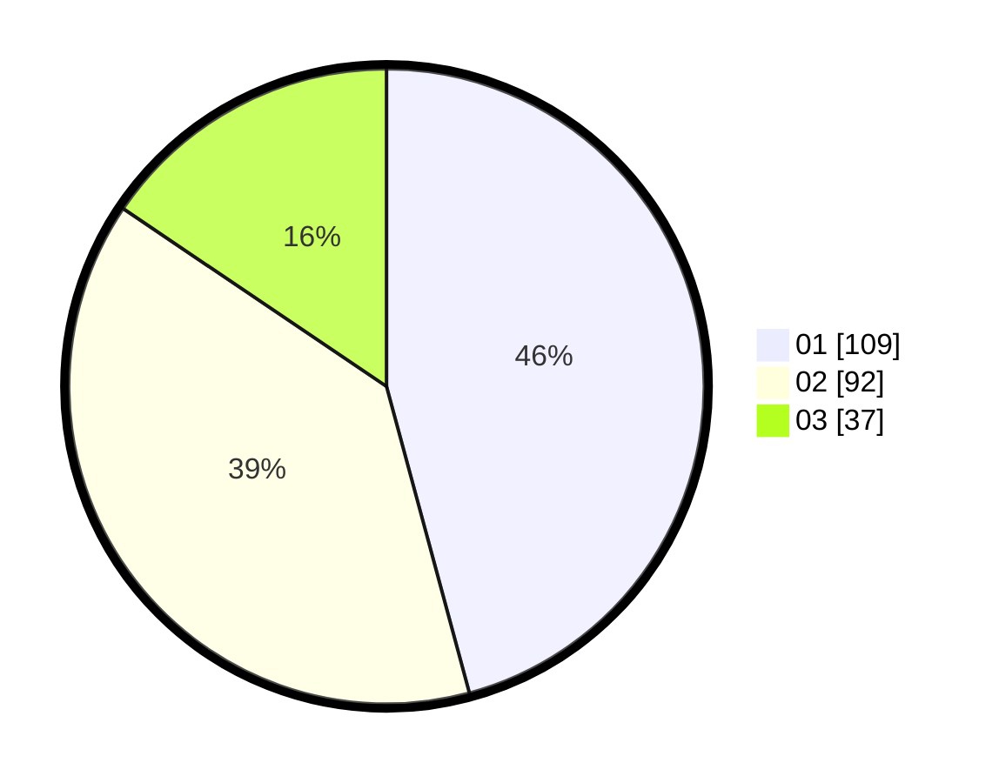

# Hasil

Hasil perolehan suara paslon dapat dilihat pada file paslon-01.txt, paslon-02.txt, dan paslon-03.txt.

Jika tidak ada, artinya data tersebut belum ada pada SIREKAP.

## Perolehan Suara

 * Paslon 01: **109**.
 * Paslon 02: **92**.
 * Paslon 03: **37**.

## Foto C Plano

https://sirekap-obj-formc.kpu.go.id/570e/pemilu/ppwp/31/74/10/10/03/3174101003057-20240214-193442--ef706477-6740-42b4-9562-506e3021bffc.jpg

https://sirekap-obj-formc.kpu.go.id/570e/pemilu/ppwp/31/74/10/10/03/3174101003057-20240214-194050--1cec80b4-c86e-4181-9532-87edc0c84fda.jpg

https://sirekap-obj-formc.kpu.go.id/570e/pemilu/ppwp/31/74/10/10/03/3174101003057-20240214-195454--7a1bfc98-12f3-488e-b9cb-f58dccbb42d8.jpg
