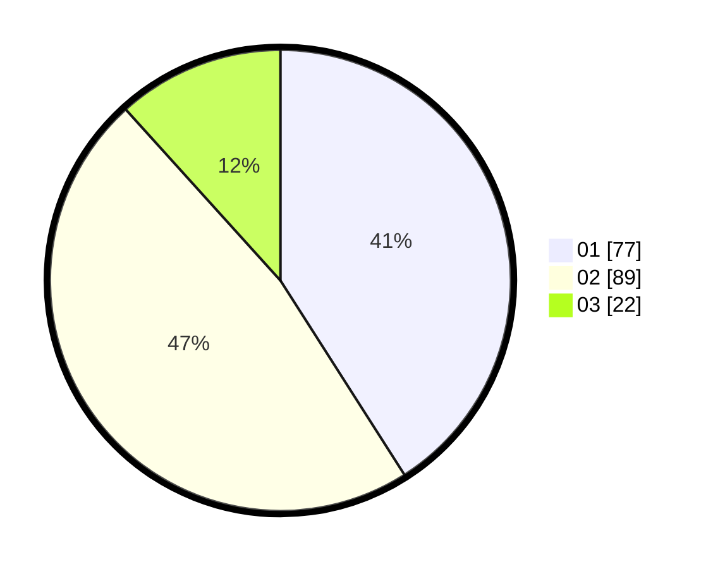

# Hasil

Hasil perolehan suara paslon dapat dilihat pada file paslon-01.txt, paslon-02.txt, dan paslon-03.txt.

Jika tidak ada, artinya data tersebut belum ada pada SIREKAP.

## Perolehan Suara

 * Paslon 01: **77**.
 * Paslon 02: **89**.
 * Paslon 03: **22**.

## Foto C Plano

https://sirekap-obj-formc.kpu.go.id/b631/pemilu/ppwp/31/74/10/10/03/3174101003058-20240215-204802--2cb3a28b-fb4e-49c8-a972-1b7427f87d58.jpg

https://sirekap-obj-formc.kpu.go.id/b631/pemilu/ppwp/31/74/10/10/03/3174101003058-20240215-204804--891369cd-61c8-48df-9e1e-dc3ab5400094.jpg

https://sirekap-obj-formc.kpu.go.id/b631/pemilu/ppwp/31/74/10/10/03/3174101003058-20240215-204803--0c912d00-bfb3-4ad6-ad42-388c9c30f5e7.jpg

## DATA PEMILIH TETAP

Jumlah pemilih dalam DPT: **260**.
 * L: **129**.
 * P: **131**.

## DATA PENGGUNA HAK PILIH

Jumlah pengguna hak pilih dalam DPT: **191**.
 * L: **84**.
 * P: **107**.

Jumlah pengguna hak pilih dalam DPTb: **0**.
 * L: **0**.
 * P: **0**.

Jumlah pengguna hak pilih dalam DPK: **2**.
 * L: **0**.
 * P: **2**.

Jumlah pengguna hak pilih: **193**.
 * L: **84**.
 * P: **109**.

## JUMLAH SUARA SAH DAN TIDAK SAH

JUMLAH SELURUH SUARA SAH: **188**.

JUMLAH SUARA TIDAK SAH: **5**.

JUMLAH SELURUH SUARA SAH DAN SUARA TIDAK SAH: **193**.
