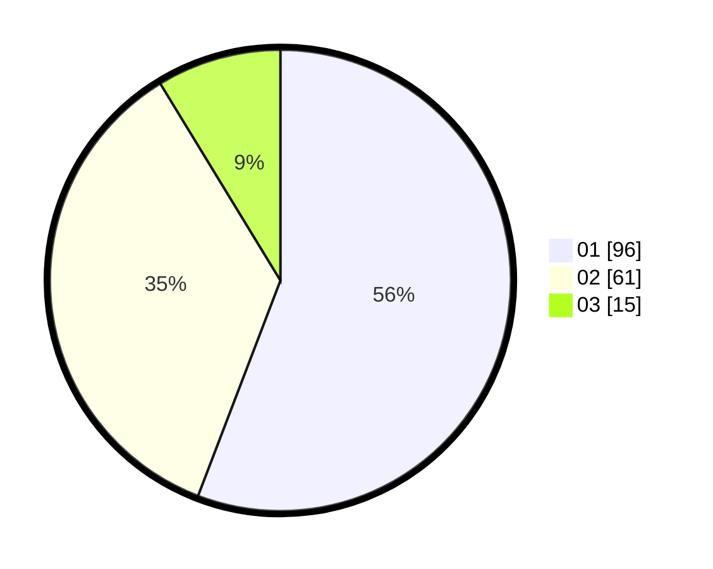

# Hasil

Hasil perolehan suara paslon dapat dilihat pada file paslon-01.txt, paslon-02.txt, dan paslon-03.txt.

Jika tidak ada, artinya data tersebut belum ada pada SIREKAP.

## Perolehan Suara

 * Paslon 01: **96**.
 * Paslon 02: **61**.
 * Paslon 03: **15**.

## Foto C Plano

https://sirekap-obj-formc.kpu.go.id/1993/pemilu/ppwp/31/74/10/10/03/3174101003060-20240215-015754--50f59a99-ae5e-4e94-bae5-518e281ba1db.jpg

https://sirekap-obj-formc.kpu.go.id/1993/pemilu/ppwp/31/74/10/10/03/3174101003060-20240215-015815--abe07324-dd70-4b75-be5c-c389df7afddc.jpg

https://sirekap-obj-formc.kpu.go.id/1993/pemilu/ppwp/31/74/10/10/03/3174101003060-20240215-015804--124d9846-559e-4487-ace2-831fdfb009db.jpg

## DATA PEMILIH TETAP

Jumlah pemilih dalam DPT: **176**.
 * L: **80**.
 * P: **96**.

## DATA PENGGUNA HAK PILIH

Jumlah pengguna hak pilih dalam DPT: **173**.
 * L: **80**.
 * P: **93**.

Jumlah pengguna hak pilih dalam DPTb: **0**.
 * L: **0**.
 * P: **0**.

Jumlah pengguna hak pilih dalam DPK: **0**.
 * L: **0**.
 * P: **3**.

Jumlah pengguna hak pilih: **176**.
 * L: **80**.
 * P: **96**.

## JUMLAH SUARA SAH DAN TIDAK SAH

JUMLAH SELURUH SUARA SAH: **172**.

JUMLAH SUARA TIDAK SAH: **4**.

JUMLAH SELURUH SUARA SAH DAN SUARA TIDAK SAH: **176**.
