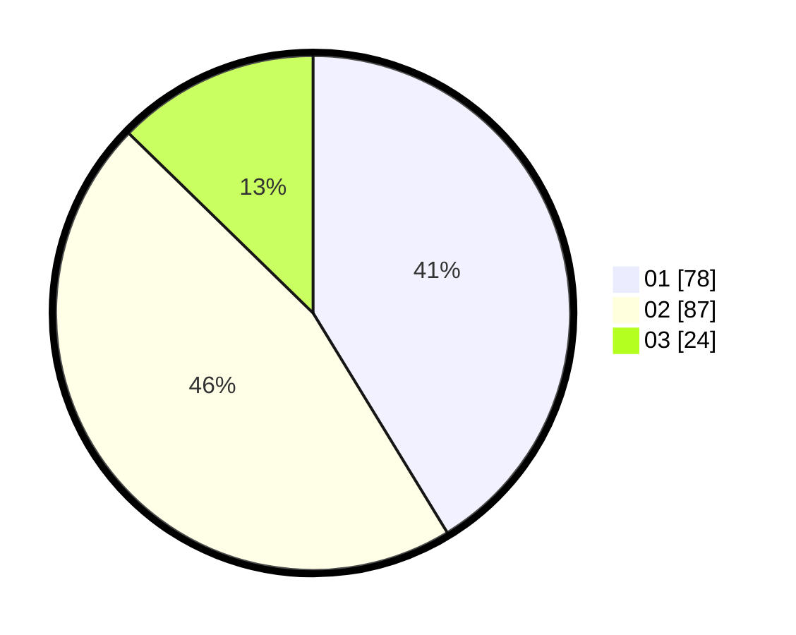

# Hasil

Hasil perolehan suara paslon dapat dilihat pada file paslon-01.txt, paslon-02.txt, dan paslon-03.txt.

Jika tidak ada, artinya data tersebut belum ada pada SIREKAP.

## Perolehan Suara

 * Paslon 01: **78**.
 * Paslon 02: **87**.
 * Paslon 03: **24**.

## Foto C Plano

https://sirekap-obj-formc.kpu.go.id/2982/pemilu/ppwp/31/74/10/10/03/3174101003065-20240214-193105--81138cac-c9a6-4f59-8f21-bcf04caeedd0.jpg

https://sirekap-obj-formc.kpu.go.id/2982/pemilu/ppwp/31/74/10/10/03/3174101003065-20240214-203639--bc1142f2-8e3c-42a5-9f7d-9e4d9a94778a.jpg

https://sirekap-obj-formc.kpu.go.id/2982/pemilu/ppwp/31/74/10/10/03/3174101003065-20240214-200616--2d448584-0100-4e7f-b8d0-5a0ef97eb18d.jpg

## DATA PEMILIH TETAP

Jumlah pemilih dalam DPT: **229**.
 * L: **114**.
 * P: **115**.

## DATA PENGGUNA HAK PILIH

Jumlah pengguna hak pilih dalam DPT: **189**.
 * L: **92**.
 * P: **97**.

Jumlah pengguna hak pilih dalam DPTb: **1**.
 * L: **1**.
 * P: **0**.

Jumlah pengguna hak pilih dalam DPK: **0**.
 * L: **0**.
 * P: **0**.

Jumlah pengguna hak pilih: **190**.
 * L: **93**.
 * P: **97**.

## JUMLAH SUARA SAH DAN TIDAK SAH

JUMLAH SELURUH SUARA SAH: **189**.

JUMLAH SUARA TIDAK SAH: **1**.

JUMLAH SELURUH SUARA SAH DAN SUARA TIDAK SAH: **190**.
