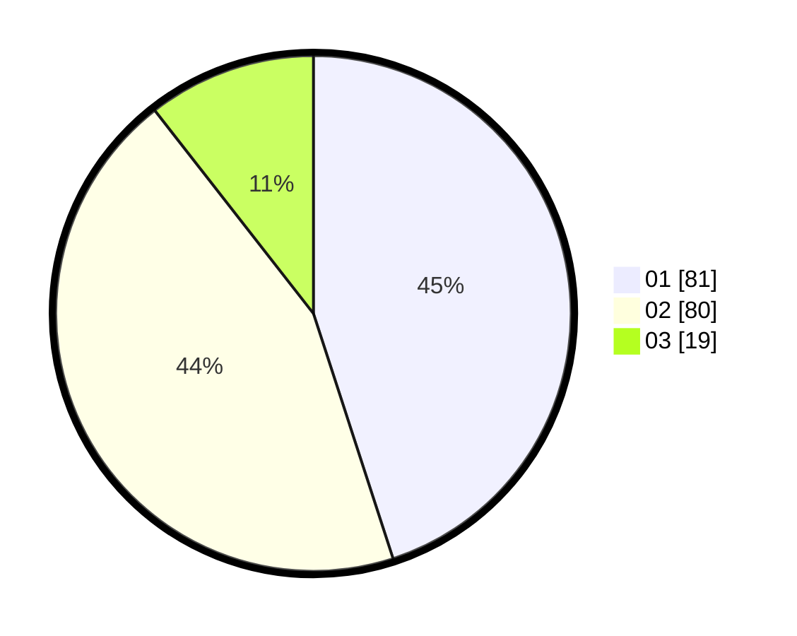

# Hasil

Hasil perolehan suara paslon dapat dilihat pada file paslon-01.txt, paslon-02.txt, dan paslon-03.txt.

Jika tidak ada, artinya data tersebut belum ada pada SIREKAP.

## Perolehan Suara

 * Paslon 01: **81**.
 * Paslon 02: **80**.
 * Paslon 03: **19**.

## Foto C Plano

https://sirekap-obj-formc.kpu.go.id/2b09/pemilu/ppwp/31/74/10/10/03/3174101003066-20240214-213944--05521a1b-875f-49eb-bd5e-176c6bbc36cf.jpg

https://sirekap-obj-formc.kpu.go.id/2b09/pemilu/ppwp/31/74/10/10/03/3174101003066-20240214-195751--aa301366-5ed4-479b-b17c-6e575e87f6c3.jpg

https://sirekap-obj-formc.kpu.go.id/2b09/pemilu/ppwp/31/74/10/10/03/3174101003066-20240214-214827--dd75a539-541a-421d-aeb9-d2387e60f091.jpg
