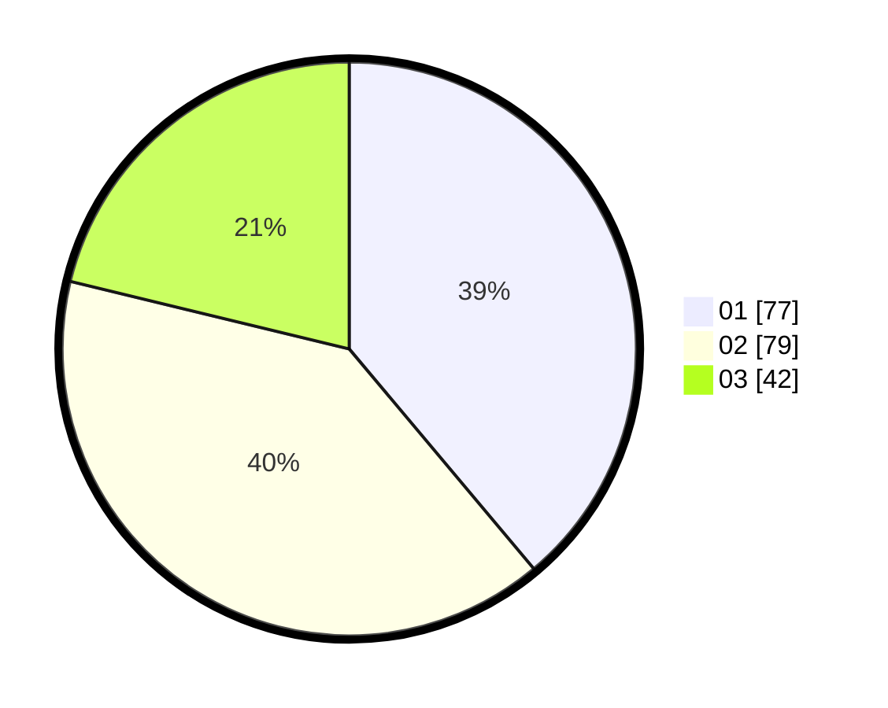

# Hasil

Hasil perolehan suara paslon dapat dilihat pada file paslon-01.txt, paslon-02.txt, dan paslon-03.txt.

Jika tidak ada, artinya data tersebut belum ada pada SIREKAP.

## Perolehan Suara

 * Paslon 01: **77**.
 * Paslon 02: **79**.
 * Paslon 03: **42**.

## Foto C Plano

https://sirekap-obj-formc.kpu.go.id/6fde/pemilu/ppwp/31/74/10/10/03/3174101003067-20240214-195349--2aee1499-a9ef-447b-bde3-6055f073d6a6.jpg

https://sirekap-obj-formc.kpu.go.id/6fde/pemilu/ppwp/31/74/10/10/03/3174101003067-20240214-195359--afd71c16-52d8-45a2-925a-69904ce3bcfa.jpg

https://sirekap-obj-formc.kpu.go.id/6fde/pemilu/ppwp/31/74/10/10/03/3174101003067-20240214-205119--dd891297-fe51-4499-a09a-463e440d3bda.jpg

## DATA PEMILIH TETAP

Jumlah pemilih dalam DPT: **227**.
 * L: **112**.
 * P: **115**.

## DATA PENGGUNA HAK PILIH

Jumlah pengguna hak pilih dalam DPT: **201**.
 * L: **100**.
 * P: **101**.

Jumlah pengguna hak pilih dalam DPTb: **0**.
 * L: **0**.
 * P: **0**.

Jumlah pengguna hak pilih dalam DPK: **2**.
 * L: **1**.
 * P: **1**.

Jumlah pengguna hak pilih: **203**.
 * L: **101**.
 * P: **102**.

## JUMLAH SUARA SAH DAN TIDAK SAH

JUMLAH SELURUH SUARA SAH: **198**.

JUMLAH SUARA TIDAK SAH: **5**.

JUMLAH SELURUH SUARA SAH DAN SUARA TIDAK SAH: **203**.
