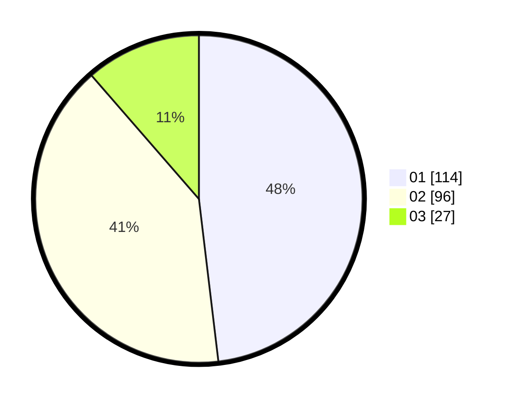

# Hasil

Hasil perolehan suara paslon dapat dilihat pada file paslon-01.txt, paslon-02.txt, dan paslon-03.txt.

Jika tidak ada, artinya data tersebut belum ada pada SIREKAP.

## Perolehan Suara

 * Paslon 01: **114**.
 * Paslon 02: **96**.
 * Paslon 03: **27**.

## Foto C Plano

https://sirekap-obj-formc.kpu.go.id/b19f/pemilu/ppwp/31/74/10/10/03/3174101003078-20240215-003118--3a0d0598-c400-4a07-bf5b-965b0cac6ff9.jpg

https://sirekap-obj-formc.kpu.go.id/b19f/pemilu/ppwp/31/74/10/10/03/3174101003078-20240215-003215--233d7d92-b8aa-4e0f-aeff-70e95894c0ba.jpg

https://sirekap-obj-formc.kpu.go.id/b19f/pemilu/ppwp/31/74/10/10/03/3174101003078-20240215-003307--a2ea9d0e-05fc-4af3-aefd-5b037dd926d1.jpg
