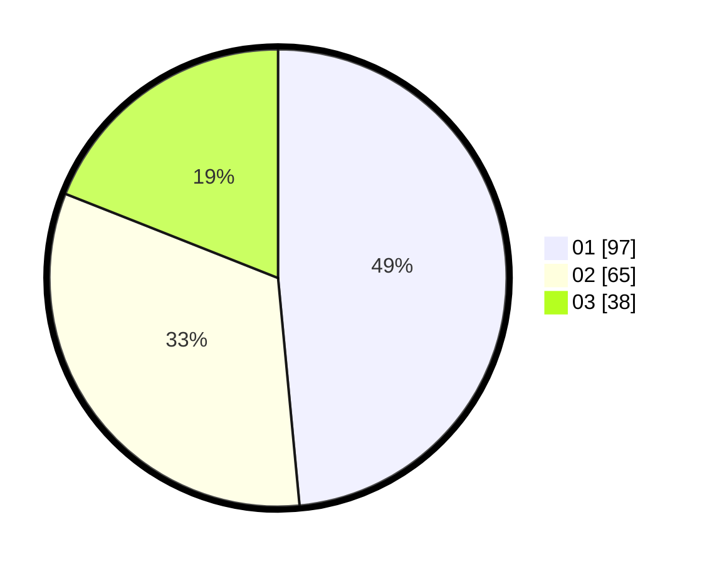

# Hasil

Hasil perolehan suara paslon dapat dilihat pada file paslon-01.txt, paslon-02.txt, dan paslon-03.txt.

Jika tidak ada, artinya data tersebut belum ada pada SIREKAP.

## Perolehan Suara

 * Paslon 01: **97**.
 * Paslon 02: **65**.
 * Paslon 03: **38**.

## Foto C Plano

https://sirekap-obj-formc.kpu.go.id/66f3/pemilu/ppwp/31/74/10/10/03/3174101003097-20240214-190748--1b1f1a45-4b2a-442b-b164-3f57d54a937a.jpg

https://sirekap-obj-formc.kpu.go.id/66f3/pemilu/ppwp/31/74/10/10/03/3174101003097-20240214-194758--2886bb9f-9ba3-46ee-bd9b-2e7d5e986d40.jpg

https://sirekap-obj-formc.kpu.go.id/66f3/pemilu/ppwp/31/74/10/10/03/3174101003097-20240214-200808--08712dae-d013-4280-8068-90645eeaa24a.jpg

## DATA PEMILIH TETAP

Jumlah pemilih dalam DPT: **239**.
 * L: **112**.
 * P: **127**.

## DATA PENGGUNA HAK PILIH

Jumlah pengguna hak pilih dalam DPT: **190**.
 * L: **83**.
 * P: **107**.

Jumlah pengguna hak pilih dalam DPTb: **10**.
 * L: **6**.
 * P: **4**.

Jumlah pengguna hak pilih dalam DPK: **1**.
 * L: **0**.
 * P: **1**.

Jumlah pengguna hak pilih: **201**.
 * L: **89**.
 * P: **112**.

## JUMLAH SUARA SAH DAN TIDAK SAH

JUMLAH SELURUH SUARA SAH: **200**.

JUMLAH SUARA TIDAK SAH: **1**.

JUMLAH SELURUH SUARA SAH DAN SUARA TIDAK SAH: **201**.
