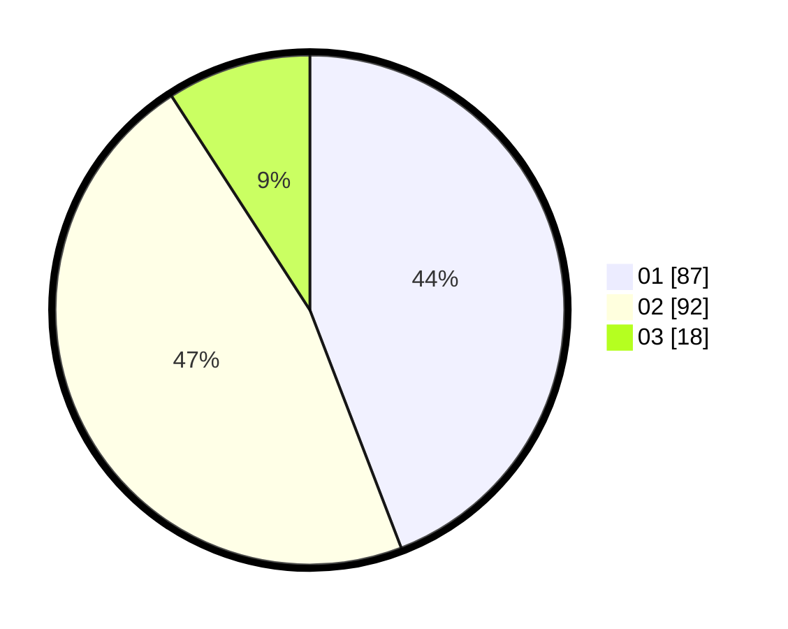

# Hasil

Hasil perolehan suara paslon dapat dilihat pada file paslon-01.txt, paslon-02.txt, dan paslon-03.txt.

Jika tidak ada, artinya data tersebut belum ada pada SIREKAP.

## Perolehan Suara

 * Paslon 01: **87**.
 * Paslon 02: **92**.
 * Paslon 03: **18**.

## Foto C Plano

https://sirekap-obj-formc.kpu.go.id/b35a/pemilu/ppwp/31/74/10/10/03/3174101003101-20240216-195442--a66365ad-aced-4537-8836-4ac252e1f6ec.jpg

https://sirekap-obj-formc.kpu.go.id/b35a/pemilu/ppwp/31/74/10/10/03/3174101003101-20240216-195444--5d500a26-c98d-4167-b6cb-462c64b97edf.jpg

https://sirekap-obj-formc.kpu.go.id/b35a/pemilu/ppwp/31/74/10/10/03/3174101003101-20240216-195443--a992f95d-7ee4-436a-9e46-baaa3ff02bd6.jpg

## DATA PEMILIH TETAP

Jumlah pemilih dalam DPT: **254**.
 * L: **122**.
 * P: **132**.

## DATA PENGGUNA HAK PILIH

Jumlah pengguna hak pilih dalam DPT: **197**.
 * L: **93**.
 * P: **104**.

Jumlah pengguna hak pilih dalam DPTb: **0**.
 * L: **0**.
 * P: **0**.

Jumlah pengguna hak pilih dalam DPK: **3**.
 * L: **2**.
 * P: **1**.

Jumlah pengguna hak pilih: **200**.
 * L: **95**.
 * P: **105**.

## JUMLAH SUARA SAH DAN TIDAK SAH

JUMLAH SELURUH SUARA SAH: **197**.

JUMLAH SUARA TIDAK SAH: **3**.

JUMLAH SELURUH SUARA SAH DAN SUARA TIDAK SAH: **200**.
