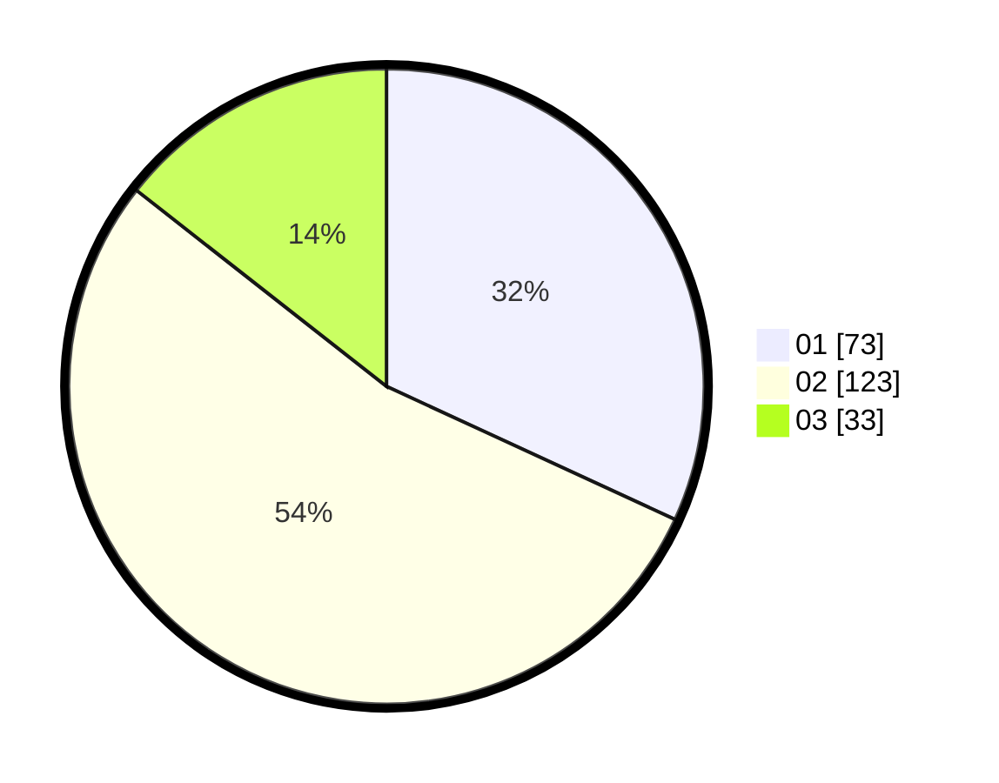

# Hasil

Hasil perolehan suara paslon dapat dilihat pada file paslon-01.txt, paslon-02.txt, dan paslon-03.txt.

Jika tidak ada, artinya data tersebut belum ada pada SIREKAP.

## Perolehan Suara

 * Paslon 01: **73**.
 * Paslon 02: **123**.
 * Paslon 03: **33**.

## Foto C Plano

https://sirekap-obj-formc.kpu.go.id/6c86/pemilu/ppwp/31/74/10/10/03/3174101003105-20240216-041446--30445ff2-d6b1-4ecf-b123-31ae45eb0e35.jpg

https://sirekap-obj-formc.kpu.go.id/6c86/pemilu/ppwp/31/74/10/10/03/3174101003105-20240216-040726--72052466-a9ad-4278-9bd1-66325f5e11fd.jpg

https://sirekap-obj-formc.kpu.go.id/6c86/pemilu/ppwp/31/74/10/10/03/3174101003105-20240216-041449--c50c0235-b1dc-479a-93eb-2ab8c89d5b2d.jpg

## DATA PEMILIH TETAP

Jumlah pemilih dalam DPT: **293**.
 * L: **138**.
 * P: **155**.

## DATA PENGGUNA HAK PILIH

Jumlah pengguna hak pilih dalam DPT: **229**.
 * L: **131**.
 * P: **98**.

Jumlah pengguna hak pilih dalam DPTb: **3**.
 * L: **1**.
 * P: **2**.

Jumlah pengguna hak pilih dalam DPK: **2**.
 * L: **2**.
 * P: **0**.

Jumlah pengguna hak pilih: **234**.
 * L: **134**.
 * P: **100**.

## JUMLAH SUARA SAH DAN TIDAK SAH

JUMLAH SELURUH SUARA SAH: **229**.

JUMLAH SUARA TIDAK SAH: **5**.

JUMLAH SELURUH SUARA SAH DAN SUARA TIDAK SAH: **234**.
