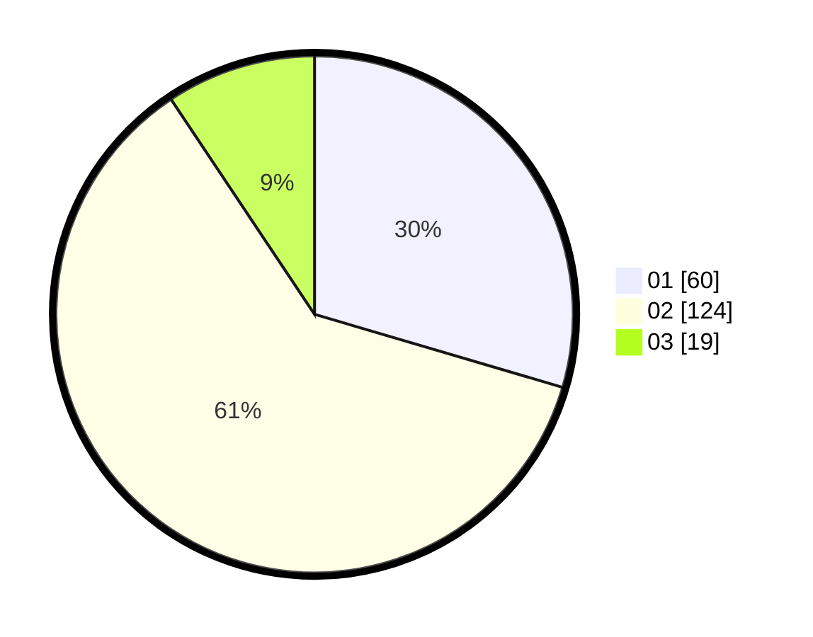

# Hasil

Hasil perolehan suara paslon dapat dilihat pada file paslon-01.txt, paslon-02.txt, dan paslon-03.txt.

Jika tidak ada, artinya data tersebut belum ada pada SIREKAP.

## Perolehan Suara

 * Paslon 01: **60**.
 * Paslon 02: **124**.
 * Paslon 03: **19**.

## Foto C Plano

https://sirekap-obj-formc.kpu.go.id/d9d4/pemilu/ppwp/31/74/10/10/03/3174101003108-20240214-155654--f4fdcc82-6670-41e6-bc1f-1ed3113c23d1.jpg

https://sirekap-obj-formc.kpu.go.id/d9d4/pemilu/ppwp/31/74/10/10/03/3174101003108-20240214-155633--eff59578-d24d-41fb-960e-272e27be0a03.jpg

https://sirekap-obj-formc.kpu.go.id/d9d4/pemilu/ppwp/31/74/10/10/03/3174101003108-20240214-155614--18b2f888-fd2b-433f-acf2-c0e30f5ca2a0.jpg

## DATA PEMILIH TETAP

Jumlah pemilih dalam DPT: **257**.
 * L: **120**.
 * P: **137**.

## DATA PENGGUNA HAK PILIH

Jumlah pengguna hak pilih dalam DPT: **202**.
 * L: **93**.
 * P: **109**.

Jumlah pengguna hak pilih dalam DPTb: **2**.
 * L: **0**.
 * P: **2**.

Jumlah pengguna hak pilih dalam DPK: **2**.
 * L: **2**.
 * P: **2**.

Jumlah pengguna hak pilih: **206**.
 * L: **94**.
 * P: **112**.

## JUMLAH SUARA SAH DAN TIDAK SAH

JUMLAH SELURUH SUARA SAH: **203**.

JUMLAH SUARA TIDAK SAH: **3**.

JUMLAH SELURUH SUARA SAH DAN SUARA TIDAK SAH: **206**.
