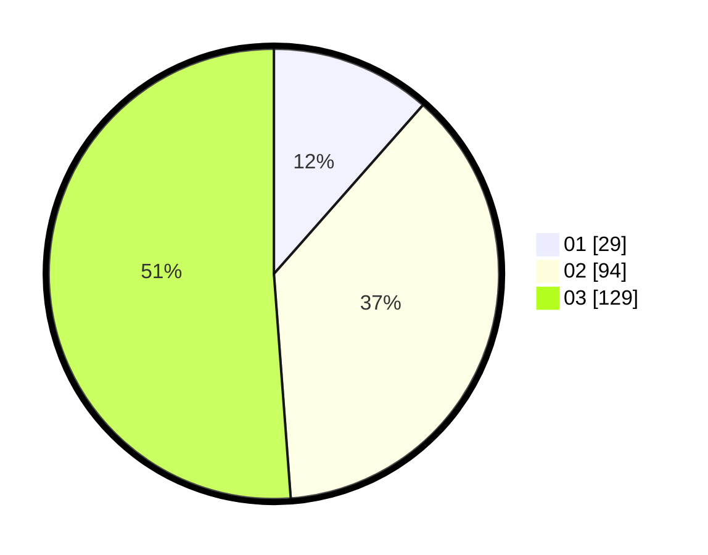

# Hasil

Hasil perolehan suara paslon dapat dilihat pada file paslon-01.txt, paslon-02.txt, dan paslon-03.txt.

Jika tidak ada, artinya data tersebut belum ada pada SIREKAP.

## Perolehan Suara

 * Paslon 01: **29**.
 * Paslon 02: **94**.
 * Paslon 03: **129**.

## Foto C Plano

https://sirekap-obj-formc.kpu.go.id/8343/pemilu/ppwp/31/74/10/10/03/3174101003114-20240215-030947--ae0bff42-4f8b-4195-9832-a745363dcf98.jpg

https://sirekap-obj-formc.kpu.go.id/8343/pemilu/ppwp/31/74/10/10/03/3174101003114-20240215-030957--ec78d481-2a7f-4d76-a687-260e08e47977.jpg

https://sirekap-obj-formc.kpu.go.id/8343/pemilu/ppwp/31/74/10/10/03/3174101003114-20240215-030954--8e100c50-b0d3-4d47-bebd-6c43eaed82ed.jpg
