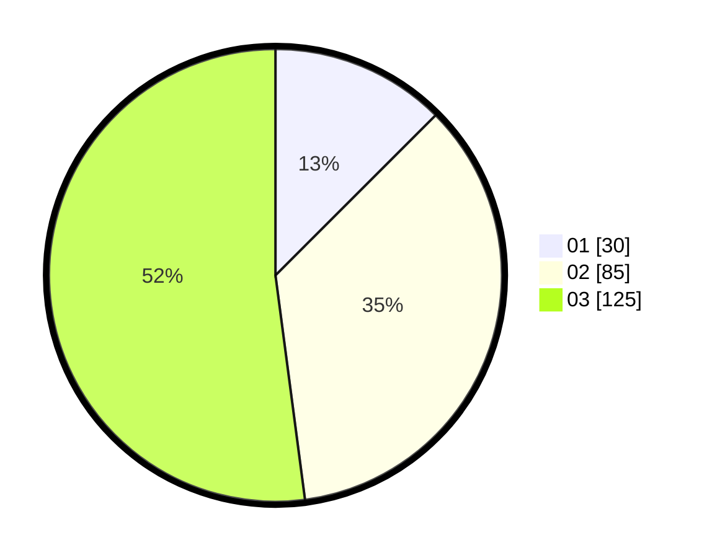

# Hasil

Hasil perolehan suara paslon dapat dilihat pada file paslon-01.txt, paslon-02.txt, dan paslon-03.txt.

Jika tidak ada, artinya data tersebut belum ada pada SIREKAP.

## Perolehan Suara

 * Paslon 01: **30**.
 * Paslon 02: **85**.
 * Paslon 03: **125**.

## Foto C Plano

https://sirekap-obj-formc.kpu.go.id/fd96/pemilu/ppwp/31/74/10/10/03/3174101003115-20240214-201130--38f32973-493e-459a-b3dc-8e237fcc2494.jpg

https://sirekap-obj-formc.kpu.go.id/fd96/pemilu/ppwp/31/74/10/10/03/3174101003115-20240214-194848--64ebda7c-1616-4918-b74d-7cc614483a5e.jpg

https://sirekap-obj-formc.kpu.go.id/fd96/pemilu/ppwp/31/74/10/10/03/3174101003115-20240214-194932--212ffd1e-5323-4941-9ff1-8358f6afe086.jpg

## DATA PEMILIH TETAP

Jumlah pemilih dalam DPT: **281**.
 * L: **127**.
 * P: **154**.

## DATA PENGGUNA HAK PILIH

Jumlah pengguna hak pilih dalam DPT: **229**.
 * L: **97**.
 * P: **132**.

Jumlah pengguna hak pilih dalam DPTb: **8**.
 * L: **4**.
 * P: **4**.

Jumlah pengguna hak pilih dalam DPK: **3**.
 * L: **1**.
 * P: **2**.

Jumlah pengguna hak pilih: **240**.
 * L: **102**.
 * P: **138**.

## JUMLAH SUARA SAH DAN TIDAK SAH

JUMLAH SELURUH SUARA SAH: **240**.

JUMLAH SUARA TIDAK SAH: **0**.

JUMLAH SELURUH SUARA SAH DAN SUARA TIDAK SAH: **240**.
