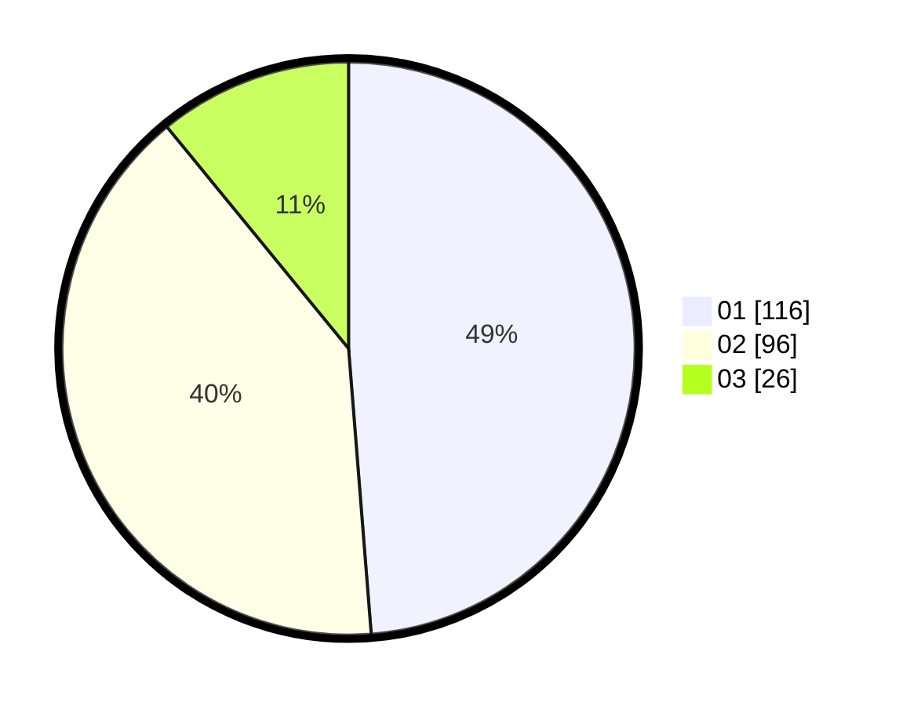

# Hasil

Hasil perolehan suara paslon dapat dilihat pada file paslon-01.txt, paslon-02.txt, dan paslon-03.txt.

Jika tidak ada, artinya data tersebut belum ada pada SIREKAP.

## Perolehan Suara

 * Paslon 01: **116**.
 * Paslon 02: **96**.
 * Paslon 03: **26**.

## Foto C Plano

https://sirekap-obj-formc.kpu.go.id/2483/pemilu/ppwp/31/74/10/10/03/3174101003119-20240214-195036--d6456661-25b4-41bc-b894-5a59807df1fd.jpg

https://sirekap-obj-formc.kpu.go.id/2483/pemilu/ppwp/31/74/10/10/03/3174101003119-20240214-200839--4192ecf6-8245-42c7-9592-8724411ac528.jpg

https://sirekap-obj-formc.kpu.go.id/2483/pemilu/ppwp/31/74/10/10/03/3174101003119-20240214-195115--15dddf08-e3f2-4eba-9dc2-959cde56eea5.jpg

## DATA PEMILIH TETAP

Jumlah pemilih dalam DPT: **296**.
 * L: **151**.
 * P: **145**.

## DATA PENGGUNA HAK PILIH

Jumlah pengguna hak pilih dalam DPT: **235**.
 * L: **121**.
 * P: **114**.

Jumlah pengguna hak pilih dalam DPTb: **21**.
 * L: **81**.
 * P: **0**.

Jumlah pengguna hak pilih dalam DPK: **2**.
 * L: **1**.
 * P: **1**.

Jumlah pengguna hak pilih: **238**.
 * L: **123**.
 * P: **115**.

## JUMLAH SUARA SAH DAN TIDAK SAH

JUMLAH SELURUH SUARA SAH: **238**.

JUMLAH SUARA TIDAK SAH: **1**.

JUMLAH SELURUH SUARA SAH DAN SUARA TIDAK SAH: **239**.
