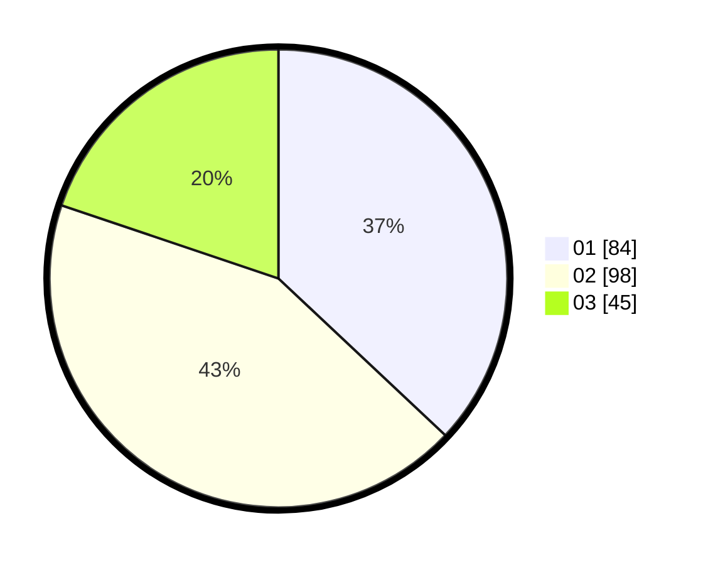

# Hasil

Hasil perolehan suara paslon dapat dilihat pada file paslon-01.txt, paslon-02.txt, dan paslon-03.txt.

Jika tidak ada, artinya data tersebut belum ada pada SIREKAP.

## Perolehan Suara

 * Paslon 01: **84**.
 * Paslon 02: **98**.
 * Paslon 03: **45**.

## Foto C Plano

https://sirekap-obj-formc.kpu.go.id/89cf/pemilu/ppwp/31/74/10/10/03/3174101003123-20240216-042845--9037cd25-a18e-4397-8911-c287c7c9af58.jpg

https://sirekap-obj-formc.kpu.go.id/89cf/pemilu/ppwp/31/74/10/10/03/3174101003123-20240216-042847--91c4800e-c05b-4ba3-a3e1-97196dd6d381.jpg

https://sirekap-obj-formc.kpu.go.id/89cf/pemilu/ppwp/31/74/10/10/03/3174101003123-20240216-042846--6ecfe134-34b6-4fdb-882a-c05bb867676d.jpg

## DATA PEMILIH TETAP

Jumlah pemilih dalam DPT: **260**.
 * L: **119**.
 * P: **141**.

## DATA PENGGUNA HAK PILIH

Jumlah pengguna hak pilih dalam DPT: **231**.
 * L: **110**.
 * P: **121**.

Jumlah pengguna hak pilih dalam DPTb: **1**.
 * L: **0**.
 * P: **1**.

Jumlah pengguna hak pilih dalam DPK: **0**.
 * L: **0**.
 * P: **0**.

Jumlah pengguna hak pilih: **232**.
 * L: **110**.
 * P: **122**.

## JUMLAH SUARA SAH DAN TIDAK SAH

JUMLAH SELURUH SUARA SAH: **227**.

JUMLAH SUARA TIDAK SAH: **5**.

JUMLAH SELURUH SUARA SAH DAN SUARA TIDAK SAH: **232**.
