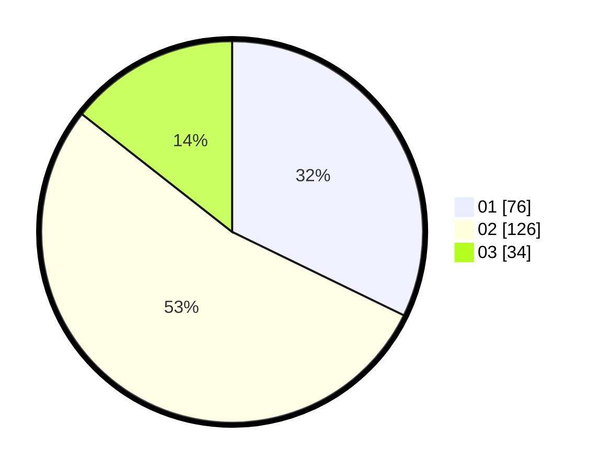

# Hasil

Hasil perolehan suara paslon dapat dilihat pada file paslon-01.txt, paslon-02.txt, dan paslon-03.txt.

Jika tidak ada, artinya data tersebut belum ada pada SIREKAP.

## Perolehan Suara

 * Paslon 01: **76**.
 * Paslon 02: **126**.
 * Paslon 03: **34**.

## Foto C Plano

https://sirekap-obj-formc.kpu.go.id/b241/pemilu/ppwp/31/74/10/10/03/3174101003124-20240215-204510--160ec0a5-aeb2-4653-bd4e-6177b262cbf2.jpg

https://sirekap-obj-formc.kpu.go.id/b241/pemilu/ppwp/31/74/10/10/03/3174101003124-20240215-204511--5e5f3b99-a9f2-4ebf-b5c8-e3de43d86055.jpg

https://sirekap-obj-formc.kpu.go.id/b241/pemilu/ppwp/31/74/10/10/03/3174101003124-20240215-204511--06f13561-498b-4d20-83d1-09935a1a61a4.jpg

## DATA PEMILIH TETAP

Jumlah pemilih dalam DPT: **286**.
 * L: **140**.
 * P: **146**.

## DATA PENGGUNA HAK PILIH

Jumlah pengguna hak pilih dalam DPT: **239**.
 * L: **120**.
 * P: **119**.

Jumlah pengguna hak pilih dalam DPTb: **4**.
 * L: **2**.
 * P: **2**.

Jumlah pengguna hak pilih dalam DPK: **0**.
 * L: **0**.
 * P: **0**.

Jumlah pengguna hak pilih: **243**.
 * L: **122**.
 * P: **121**.

## JUMLAH SUARA SAH DAN TIDAK SAH

JUMLAH SELURUH SUARA SAH: **236**.

JUMLAH SUARA TIDAK SAH: **7**.

JUMLAH SELURUH SUARA SAH DAN SUARA TIDAK SAH: **243**.
