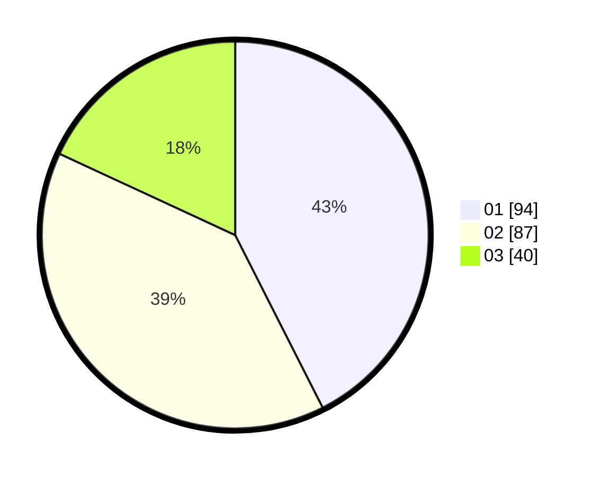

# Hasil

Hasil perolehan suara paslon dapat dilihat pada file paslon-01.txt, paslon-02.txt, dan paslon-03.txt.

Jika tidak ada, artinya data tersebut belum ada pada SIREKAP.

## Perolehan Suara

 * Paslon 01: **94**.
 * Paslon 02: **87**.
 * Paslon 03: **40**.

## Foto C Plano

https://sirekap-obj-formc.kpu.go.id/f039/pemilu/ppwp/31/74/10/10/03/3174101003125-20240215-020444--51be2e02-4475-4efa-8bfa-7a778b0fec57.jpg

https://sirekap-obj-formc.kpu.go.id/f039/pemilu/ppwp/31/74/10/10/03/3174101003125-20240215-020509--8b280d91-25a7-465e-afb3-b032dc11d248.jpg

https://sirekap-obj-formc.kpu.go.id/f039/pemilu/ppwp/31/74/10/10/03/3174101003125-20240215-020525--459328ab-9342-4bc8-9a7b-6da439cfd0bc.jpg

## DATA PEMILIH TETAP

Jumlah pemilih dalam DPT: **289**.
 * L: **144**.
 * P: **145**.

## DATA PENGGUNA HAK PILIH

Jumlah pengguna hak pilih dalam DPT: **222**.
 * L: **109**.
 * P: **113**.

Jumlah pengguna hak pilih dalam DPTb: **2**.
 * L: **1**.
 * P: **1**.

Jumlah pengguna hak pilih dalam DPK: **0**.
 * L: **0**.
 * P: **0**.

Jumlah pengguna hak pilih: **224**.
 * L: **110**.
 * P: **114**.

## JUMLAH SUARA SAH DAN TIDAK SAH

JUMLAH SELURUH SUARA SAH: **221**.

JUMLAH SUARA TIDAK SAH: **3**.

JUMLAH SELURUH SUARA SAH DAN SUARA TIDAK SAH: **224**.
