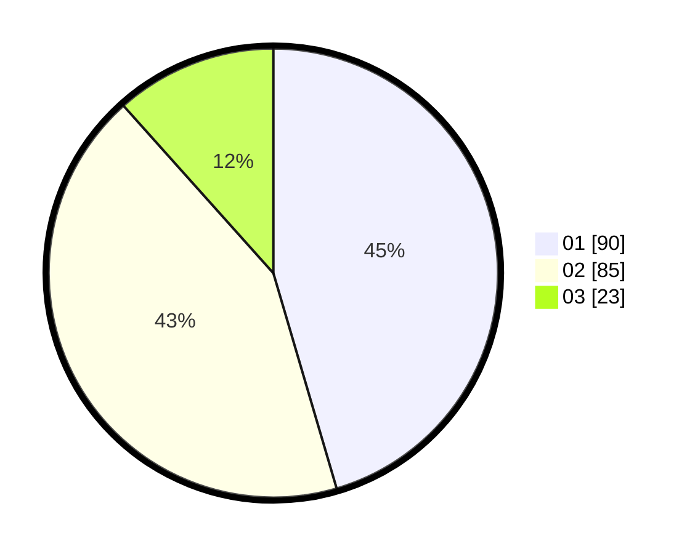

# Hasil

Hasil perolehan suara paslon dapat dilihat pada file paslon-01.txt, paslon-02.txt, dan paslon-03.txt.

Jika tidak ada, artinya data tersebut belum ada pada SIREKAP.

## Perolehan Suara

 * Paslon 01: **90**.
 * Paslon 02: **85**.
 * Paslon 03: **23**.

## Foto C Plano

https://sirekap-obj-formc.kpu.go.id/6758/pemilu/ppwp/31/74/10/10/03/3174101003126-20240214-185213--edb4bad9-907a-41f7-88bb-fa8bd596a569.jpg

https://sirekap-obj-formc.kpu.go.id/6758/pemilu/ppwp/31/74/10/10/03/3174101003126-20240214-185939--9630d631-96f0-4931-b0bb-44a1d495b6c5.jpg

https://sirekap-obj-formc.kpu.go.id/6758/pemilu/ppwp/31/74/10/10/03/3174101003126-20240214-190038--05153a80-9458-4870-b534-831019fa017a.jpg

## DATA PEMILIH TETAP

Jumlah pemilih dalam DPT: **241**.
 * L: **116**.
 * P: **125**.

## DATA PENGGUNA HAK PILIH

Jumlah pengguna hak pilih dalam DPT: **196**.
 * L: **92**.
 * P: **104**.

Jumlah pengguna hak pilih dalam DPTb: **4**.
 * L: **2**.
 * P: **2**.

Jumlah pengguna hak pilih dalam DPK: **2**.
 * L: **1**.
 * P: **1**.

Jumlah pengguna hak pilih: **202**.
 * L: **95**.
 * P: **107**.

## JUMLAH SUARA SAH DAN TIDAK SAH

JUMLAH SELURUH SUARA SAH: **198**.

JUMLAH SUARA TIDAK SAH: **4**.

JUMLAH SELURUH SUARA SAH DAN SUARA TIDAK SAH: **202**.
