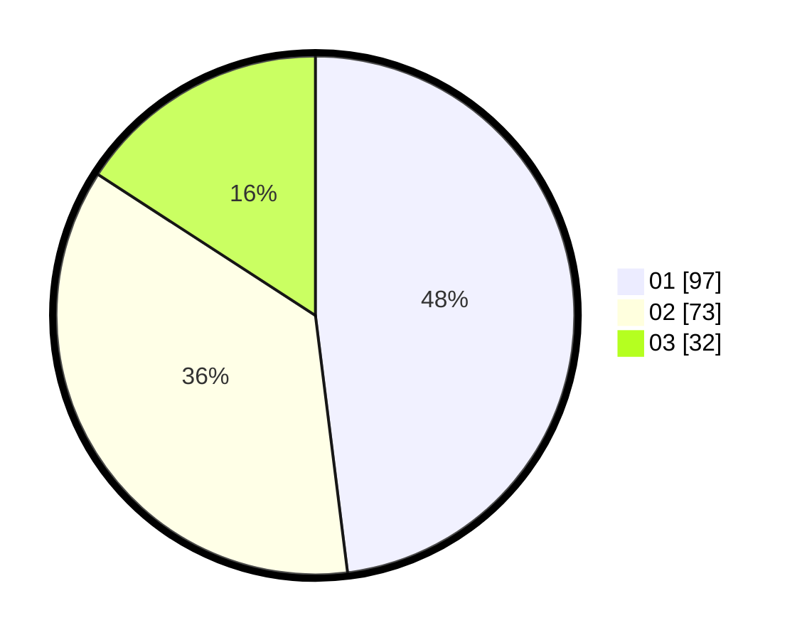

# Hasil

Hasil perolehan suara paslon dapat dilihat pada file paslon-01.txt, paslon-02.txt, dan paslon-03.txt.

Jika tidak ada, artinya data tersebut belum ada pada SIREKAP.

## Perolehan Suara

 * Paslon 01: **97**.
 * Paslon 02: **73**.
 * Paslon 03: **32**.

## Foto C Plano

https://sirekap-obj-formc.kpu.go.id/aade/pemilu/ppwp/31/74/10/10/03/3174101003144-20240216-002105--438e3b4d-9ec0-4011-9572-cc49f3ea7bec.jpg

https://sirekap-obj-formc.kpu.go.id/aade/pemilu/ppwp/31/74/10/10/03/3174101003144-20240216-002108--91138e4f-cddb-4347-a964-db8fda704960.jpg

https://sirekap-obj-formc.kpu.go.id/aade/pemilu/ppwp/31/74/10/10/03/3174101003144-20240216-002106--2a32a3c0-a383-4ffd-bc69-4b33b1e4bb48.jpg

## DATA PEMILIH TETAP

Jumlah pemilih dalam DPT: **277**.
 * L: **141**.
 * P: **136**.

## DATA PENGGUNA HAK PILIH

Jumlah pengguna hak pilih dalam DPT: **205**.
 * L: **105**.
 * P: **100**.

Jumlah pengguna hak pilih dalam DPTb: **0**.
 * L: **0**.
 * P: **0**.

Jumlah pengguna hak pilih dalam DPK: **0**.
 * L: **0**.
 * P: **0**.

Jumlah pengguna hak pilih: **205**.
 * L: **105**.
 * P: **100**.

## JUMLAH SUARA SAH DAN TIDAK SAH

JUMLAH SELURUH SUARA SAH: **202**.

JUMLAH SUARA TIDAK SAH: **3**.

JUMLAH SELURUH SUARA SAH DAN SUARA TIDAK SAH: **205**.
