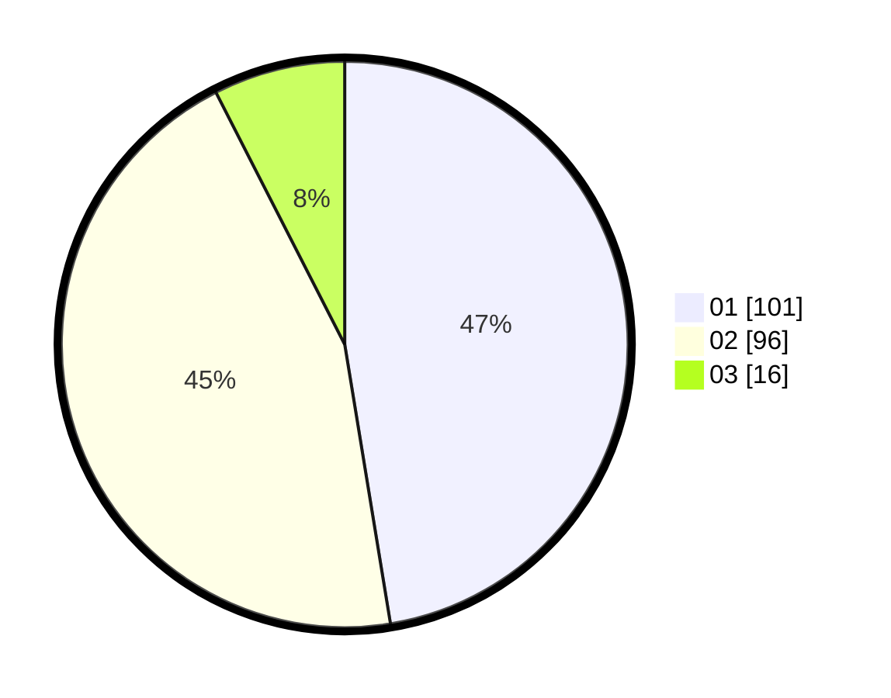

# Hasil

Hasil perolehan suara paslon dapat dilihat pada file paslon-01.txt, paslon-02.txt, dan paslon-03.txt.

Jika tidak ada, artinya data tersebut belum ada pada SIREKAP.

## Perolehan Suara

 * Paslon 01: **101**.
 * Paslon 02: **96**.
 * Paslon 03: **16**.

## Foto C Plano

https://sirekap-obj-formc.kpu.go.id/326e/pemilu/ppwp/31/74/10/10/03/3174101003146-20240216-145446--1d2ca94f-4516-4fcf-8ed0-819f4e660e66.jpg

https://sirekap-obj-formc.kpu.go.id/326e/pemilu/ppwp/31/74/10/10/03/3174101003146-20240216-145447--f2c30e20-48b3-4694-8209-43eed947b625.jpg

https://sirekap-obj-formc.kpu.go.id/326e/pemilu/ppwp/31/74/10/10/03/3174101003146-20240216-145447--9e90a4f9-4e0b-44b4-9500-df2fef20b482.jpg

## DATA PEMILIH TETAP

Jumlah pemilih dalam DPT: **279**.
 * L: **137**.
 * P: **142**.

## DATA PENGGUNA HAK PILIH

Jumlah pengguna hak pilih dalam DPT: **214**.
 * L: **94**.
 * P: **120**.

Jumlah pengguna hak pilih dalam DPTb: **1**.
 * L: **1**.
 * P: **0**.

Jumlah pengguna hak pilih dalam DPK: **0**.
 * L: **0**.
 * P: **0**.

Jumlah pengguna hak pilih: **215**.
 * L: **95**.
 * P: **120**.

## JUMLAH SUARA SAH DAN TIDAK SAH

JUMLAH SELURUH SUARA SAH: **213**.

JUMLAH SUARA TIDAK SAH: **2**.

JUMLAH SELURUH SUARA SAH DAN SUARA TIDAK SAH: **215**.
