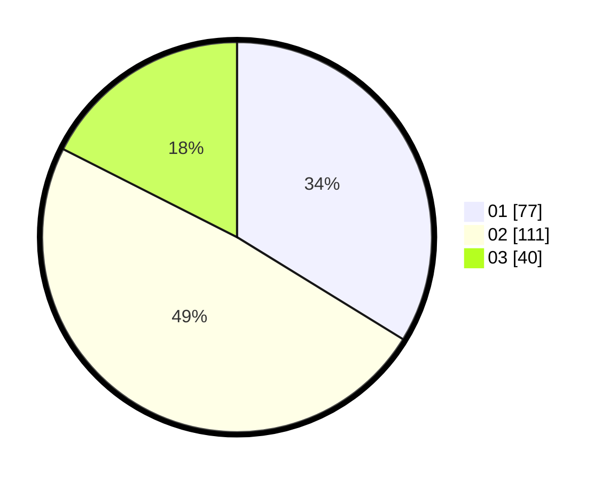

# Hasil

Hasil perolehan suara paslon dapat dilihat pada file paslon-01.txt, paslon-02.txt, dan paslon-03.txt.

Jika tidak ada, artinya data tersebut belum ada pada SIREKAP.

## Perolehan Suara

 * Paslon 01: **77**.
 * Paslon 02: **111**.
 * Paslon 03: **40**.

## Foto C Plano

https://sirekap-obj-formc.kpu.go.id/a218/pemilu/ppwp/31/74/10/10/03/3174101003147-20240216-082341--08596cbb-48b6-471f-bb5d-3d925b76a8c7.jpg

https://sirekap-obj-formc.kpu.go.id/a218/pemilu/ppwp/31/74/10/10/03/3174101003147-20240216-082353--027b2e3e-a806-4a22-aca7-5462395b6296.jpg

https://sirekap-obj-formc.kpu.go.id/a218/pemilu/ppwp/31/74/10/10/03/3174101003147-20240216-082345--8c532faf-510d-4807-b03c-a0517b02b5b7.jpg

## DATA PEMILIH TETAP

Jumlah pemilih dalam DPT: **281**.
 * L: **138**.
 * P: **143**.

## DATA PENGGUNA HAK PILIH

Jumlah pengguna hak pilih dalam DPT: **217**.
 * L: **103**.
 * P: **114**.

Jumlah pengguna hak pilih dalam DPTb: **6**.
 * L: **3**.
 * P: **3**.

Jumlah pengguna hak pilih dalam DPK: **7**.
 * L: **5**.
 * P: **2**.

Jumlah pengguna hak pilih: **230**.
 * L: **111**.
 * P: **119**.

## JUMLAH SUARA SAH DAN TIDAK SAH

JUMLAH SELURUH SUARA SAH: **228**.

JUMLAH SUARA TIDAK SAH: **2**.

JUMLAH SELURUH SUARA SAH DAN SUARA TIDAK SAH: **230**.
