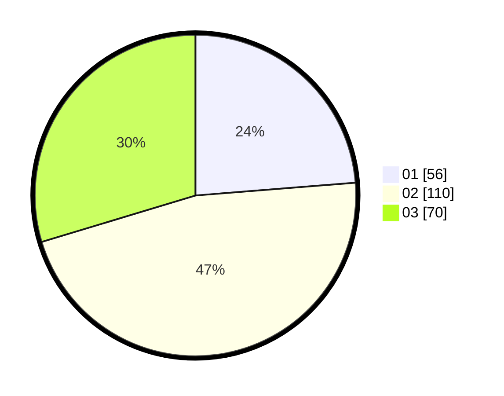

# Hasil

Hasil perolehan suara paslon dapat dilihat pada file paslon-01.txt, paslon-02.txt, dan paslon-03.txt.

Jika tidak ada, artinya data tersebut belum ada pada SIREKAP.

## Perolehan Suara

 * Paslon 01: **56**.
 * Paslon 02: **110**.
 * Paslon 03: **70**.

## Foto C Plano

https://sirekap-obj-formc.kpu.go.id/adde/pemilu/ppwp/31/74/10/10/03/3174101003161-20240215-012553--2c2cb1f9-684f-4bf4-8fe7-55098ff42d50.jpg

https://sirekap-obj-formc.kpu.go.id/adde/pemilu/ppwp/31/74/10/10/03/3174101003161-20240214-155257--953cf577-d4c0-46d9-a26a-39b99f38b8df.jpg

https://sirekap-obj-formc.kpu.go.id/adde/pemilu/ppwp/31/74/10/10/03/3174101003161-20240214-155326--bcc19f09-73af-41e8-af74-66a3c40288f5.jpg

## DATA PEMILIH TETAP

Jumlah pemilih dalam DPT: **290**.
 * L: **140**.
 * P: **150**.

## DATA PENGGUNA HAK PILIH

Jumlah pengguna hak pilih dalam DPT: **235**.
 * L: **109**.
 * P: **126**.

Jumlah pengguna hak pilih dalam DPTb: **0**.
 * L: **0**.
 * P: **0**.

Jumlah pengguna hak pilih dalam DPK: **6**.
 * L: **2**.
 * P: **4**.

Jumlah pengguna hak pilih: **241**.
 * L: **111**.
 * P: **130**.

## JUMLAH SUARA SAH DAN TIDAK SAH

JUMLAH SELURUH SUARA SAH: **236**.

JUMLAH SUARA TIDAK SAH: **5**.

JUMLAH SELURUH SUARA SAH DAN SUARA TIDAK SAH: **241**.
