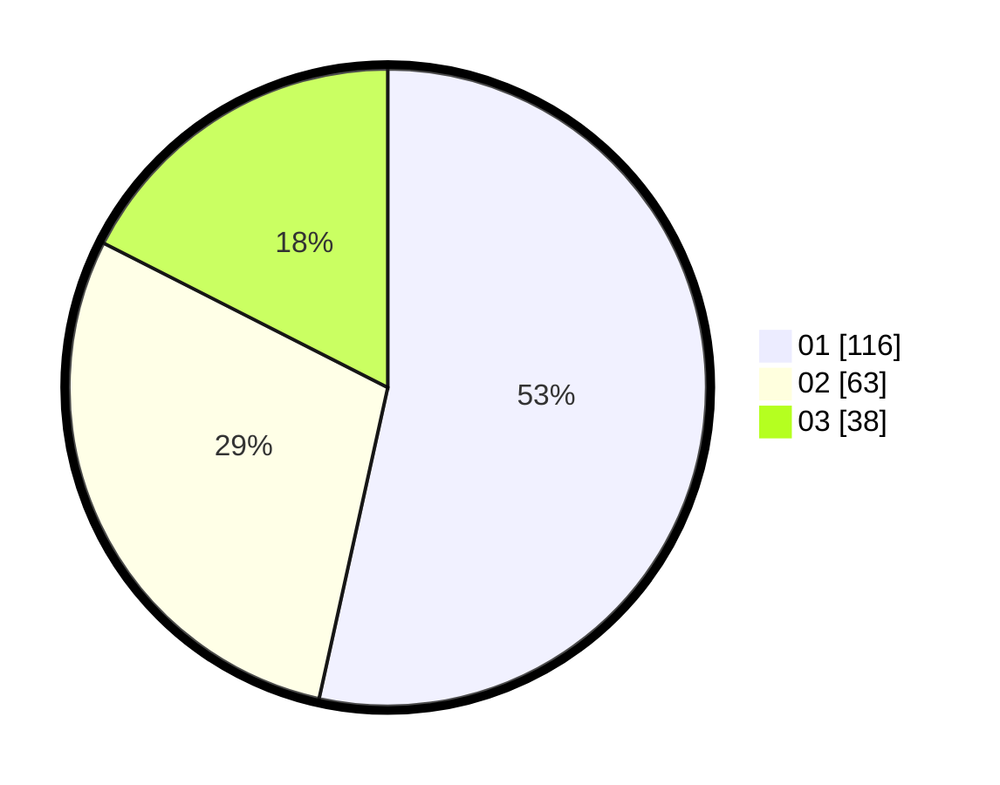

# Hasil

Hasil perolehan suara paslon dapat dilihat pada file paslon-01.txt, paslon-02.txt, dan paslon-03.txt.

Jika tidak ada, artinya data tersebut belum ada pada SIREKAP.

## Perolehan Suara

 * Paslon 01: **116**.
 * Paslon 02: **63**.
 * Paslon 03: **38**.

## Foto C Plano

https://sirekap-obj-formc.kpu.go.id/2a7b/pemilu/ppwp/31/74/10/10/03/3174101003175-20240215-191527--9a94a205-915f-4c4e-9b22-25cc58dd51e8.jpg

https://sirekap-obj-formc.kpu.go.id/2a7b/pemilu/ppwp/31/74/10/10/03/3174101003175-20240215-191550--d9086ad3-de60-4c0e-8679-35b4103332b9.jpg

https://sirekap-obj-formc.kpu.go.id/2a7b/pemilu/ppwp/31/74/10/10/03/3174101003175-20240215-191539--3d0690ce-fb88-487a-9bcd-824d96e71026.jpg

## DATA PEMILIH TETAP

Jumlah pemilih dalam DPT: **268**.
 * L: **128**.
 * P: **140**.

## DATA PENGGUNA HAK PILIH

Jumlah pengguna hak pilih dalam DPT: **207**.
 * L: **96**.
 * P: **111**.

Jumlah pengguna hak pilih dalam DPTb: **4**.
 * L: **2**.
 * P: **2**.

Jumlah pengguna hak pilih dalam DPK: **9**.
 * L: **4**.
 * P: **5**.

Jumlah pengguna hak pilih: **220**.
 * L: **102**.
 * P: **118**.

## JUMLAH SUARA SAH DAN TIDAK SAH

JUMLAH SELURUH SUARA SAH: **217**.

JUMLAH SUARA TIDAK SAH: **3**.

JUMLAH SELURUH SUARA SAH DAN SUARA TIDAK SAH: **220**.
