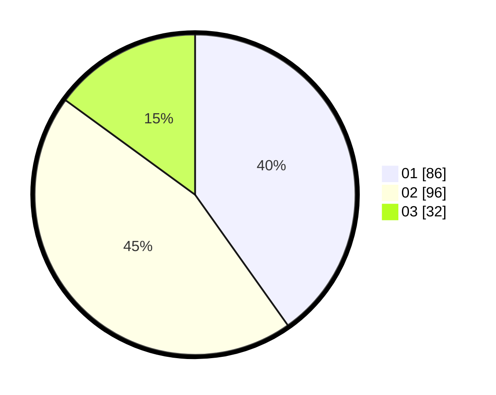

# Hasil

Hasil perolehan suara paslon dapat dilihat pada file paslon-01.txt, paslon-02.txt, dan paslon-03.txt.

Jika tidak ada, artinya data tersebut belum ada pada SIREKAP.

## Perolehan Suara

 * Paslon 01: **86**.
 * Paslon 02: **96**.
 * Paslon 03: **32**.

## Foto C Plano

https://sirekap-obj-formc.kpu.go.id/90de/pemilu/ppwp/31/74/10/10/03/3174101003176-20240215-012949--c140f94d-e92b-45f2-bd09-262279218d3c.jpg

https://sirekap-obj-formc.kpu.go.id/90de/pemilu/ppwp/31/74/10/10/03/3174101003176-20240215-013014--b1e3cd34-e61a-472d-82fe-6a62ea22c38b.jpg

https://sirekap-obj-formc.kpu.go.id/90de/pemilu/ppwp/31/74/10/10/03/3174101003176-20240215-013003--bd074454-077e-4245-9690-a055f6f838ab.jpg

## DATA PEMILIH TETAP

Jumlah pemilih dalam DPT: **271**.
 * L: **132**.
 * P: **139**.

## DATA PENGGUNA HAK PILIH

Jumlah pengguna hak pilih dalam DPT: **215**.
 * L: **104**.
 * P: **111**.

Jumlah pengguna hak pilih dalam DPTb: **1**.
 * L: **0**.
 * P: **1**.

Jumlah pengguna hak pilih dalam DPK: **1**.
 * L: **0**.
 * P: **1**.

Jumlah pengguna hak pilih: **217**.
 * L: **104**.
 * P: **113**.

## JUMLAH SUARA SAH DAN TIDAK SAH

JUMLAH SELURUH SUARA SAH: **214**.

JUMLAH SUARA TIDAK SAH: **3**.

JUMLAH SELURUH SUARA SAH DAN SUARA TIDAK SAH: **217**.
