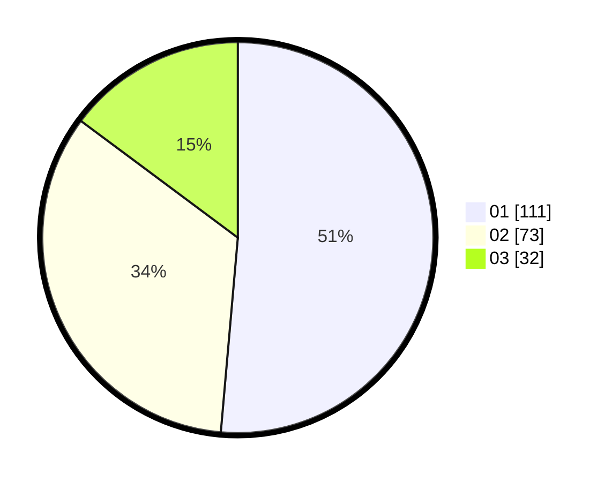

# Hasil

Hasil perolehan suara paslon dapat dilihat pada file paslon-01.txt, paslon-02.txt, dan paslon-03.txt.

Jika tidak ada, artinya data tersebut belum ada pada SIREKAP.

## Perolehan Suara

 * Paslon 01: **111**.
 * Paslon 02: **73**.
 * Paslon 03: **32**.

## Foto C Plano

https://sirekap-obj-formc.kpu.go.id/e068/pemilu/ppwp/31/74/10/10/03/3174101003177-20240215-212422--f57fe9dc-1efa-435e-87ae-11de5d30c597.jpg

https://sirekap-obj-formc.kpu.go.id/e068/pemilu/ppwp/31/74/10/10/03/3174101003177-20240215-212424--c4b26c9f-06e2-4b53-8c33-e0b1310d18fc.jpg

https://sirekap-obj-formc.kpu.go.id/e068/pemilu/ppwp/31/74/10/10/03/3174101003177-20240215-212423--405aea83-5dcb-455e-8fef-daf79d738af0.jpg

## DATA PEMILIH TETAP

Jumlah pemilih dalam DPT: **272**.
 * L: **130**.
 * P: **142**.

## DATA PENGGUNA HAK PILIH

Jumlah pengguna hak pilih dalam DPT: **212**.
 * L: **103**.
 * P: **109**.

Jumlah pengguna hak pilih dalam DPTb: **2**.
 * L: **1**.
 * P: **1**.

Jumlah pengguna hak pilih dalam DPK: **2**.
 * L: **1**.
 * P: **1**.

Jumlah pengguna hak pilih: **216**.
 * L: **105**.
 * P: **111**.

## JUMLAH SUARA SAH DAN TIDAK SAH

JUMLAH SELURUH SUARA SAH: **216**.

JUMLAH SUARA TIDAK SAH: **0**.

JUMLAH SELURUH SUARA SAH DAN SUARA TIDAK SAH: **216**.
