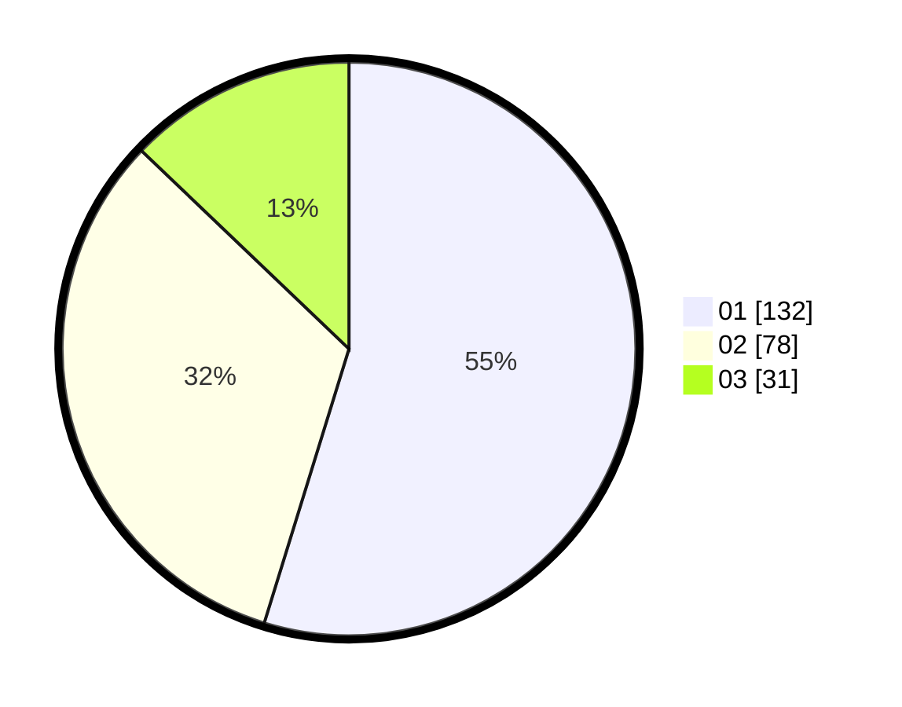

# Hasil

Hasil perolehan suara paslon dapat dilihat pada file paslon-01.txt, paslon-02.txt, dan paslon-03.txt.

Jika tidak ada, artinya data tersebut belum ada pada SIREKAP.

## Perolehan Suara

 * Paslon 01: **132**.
 * Paslon 02: **78**.
 * Paslon 03: **31**.

## Foto C Plano

https://sirekap-obj-formc.kpu.go.id/e163/pemilu/ppwp/31/74/10/10/03/3174101003179-20240216-233102--1ded92f4-a8a1-448d-8af8-809669d8f696.jpg

https://sirekap-obj-formc.kpu.go.id/e163/pemilu/ppwp/31/74/10/10/03/3174101003179-20240216-235702--1d7a76e5-a9ef-4c31-9231-af4aa4813eb2.jpg

https://sirekap-obj-formc.kpu.go.id/e163/pemilu/ppwp/31/74/10/10/03/3174101003179-20240216-235049--1999b7fb-fb09-4c6e-9ef9-67558f1b8778.jpg

## DATA PEMILIH TETAP

Jumlah pemilih dalam DPT: **276**.
 * L: **137**.
 * P: **139**.

## DATA PENGGUNA HAK PILIH

Jumlah pengguna hak pilih dalam DPT: **242**.
 * L: **114**.
 * P: **128**.

Jumlah pengguna hak pilih dalam DPTb: **1**.
 * L: **1**.
 * P: **0**.

Jumlah pengguna hak pilih dalam DPK: **1**.
 * L: **1**.
 * P: **0**.

Jumlah pengguna hak pilih: **244**.
 * L: **116**.
 * P: **128**.

## JUMLAH SUARA SAH DAN TIDAK SAH

JUMLAH SELURUH SUARA SAH: **241**.

JUMLAH SUARA TIDAK SAH: **3**.

JUMLAH SELURUH SUARA SAH DAN SUARA TIDAK SAH: **244**.
