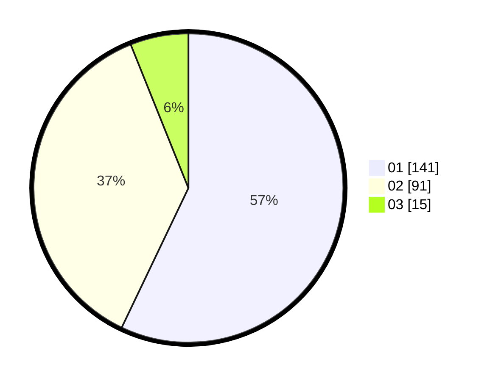

# Hasil

Hasil perolehan suara paslon dapat dilihat pada file paslon-01.txt, paslon-02.txt, dan paslon-03.txt.

Jika tidak ada, artinya data tersebut belum ada pada SIREKAP.

## Perolehan Suara

 * Paslon 01: **141**.
 * Paslon 02: **91**.
 * Paslon 03: **15**.

## Foto C Plano

https://sirekap-obj-formc.kpu.go.id/9c3b/pemilu/ppwp/31/74/10/10/03/3174101003182-20240216-210735--10f51329-a101-4f3c-9423-d8c56975cbc7.jpg

https://sirekap-obj-formc.kpu.go.id/9c3b/pemilu/ppwp/31/74/10/10/03/3174101003182-20240216-210736--5231b3dc-7430-4b8c-9c04-1a34d376a79e.jpg

https://sirekap-obj-formc.kpu.go.id/9c3b/pemilu/ppwp/31/74/10/10/03/3174101003182-20240216-210735--c6fc48c7-af87-4591-82ea-0814c56d359e.jpg

## DATA PEMILIH TETAP

Jumlah pemilih dalam DPT: **287**.
 * L: **149**.
 * P: **138**.

## DATA PENGGUNA HAK PILIH

Jumlah pengguna hak pilih dalam DPT: **248**.
 * L: **128**.
 * P: **120**.

Jumlah pengguna hak pilih dalam DPTb: **0**.
 * L: **0**.
 * P: **0**.

Jumlah pengguna hak pilih dalam DPK: **2**.
 * L: **1**.
 * P: **1**.

Jumlah pengguna hak pilih: **250**.
 * L: **129**.
 * P: **121**.

## JUMLAH SUARA SAH DAN TIDAK SAH

JUMLAH SELURUH SUARA SAH: **247**.

JUMLAH SUARA TIDAK SAH: **3**.

JUMLAH SELURUH SUARA SAH DAN SUARA TIDAK SAH: **250**.
