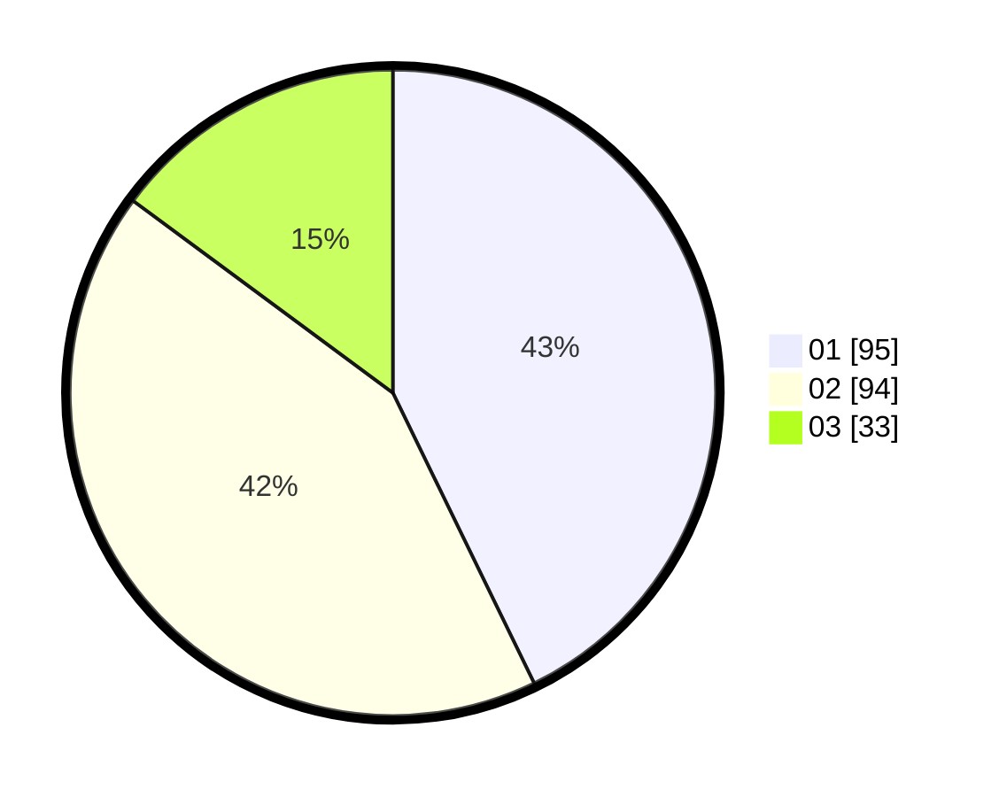

# Hasil

Hasil perolehan suara paslon dapat dilihat pada file paslon-01.txt, paslon-02.txt, dan paslon-03.txt.

Jika tidak ada, artinya data tersebut belum ada pada SIREKAP.

## Perolehan Suara

 * Paslon 01: **95**.
 * Paslon 02: **94**.
 * Paslon 03: **33**.

## Foto C Plano

https://sirekap-obj-formc.kpu.go.id/3c6b/pemilu/ppwp/31/74/10/10/04/3174101004003-20240214-185627--22145d3f-88a3-4677-9906-a38eadf5673c.jpg

https://sirekap-obj-formc.kpu.go.id/3c6b/pemilu/ppwp/31/74/10/10/04/3174101004003-20240214-185645--7e0b15a9-a460-4073-a3a4-85582547a2be.jpg

https://sirekap-obj-formc.kpu.go.id/3c6b/pemilu/ppwp/31/74/10/10/04/3174101004003-20240214-185654--688ee216-e70c-40a2-8240-69362f9d2f73.jpg

## DATA PEMILIH TETAP

Jumlah pemilih dalam DPT: **270**.
 * L: **127**.
 * P: **143**.

## DATA PENGGUNA HAK PILIH

Jumlah pengguna hak pilih dalam DPT: **222**.
 * L: **103**.
 * P: **119**.

Jumlah pengguna hak pilih dalam DPTb: **3**.
 * L: **2**.
 * P: **1**.

Jumlah pengguna hak pilih dalam DPK: **0**.
 * L: **0**.
 * P: **0**.

Jumlah pengguna hak pilih: **225**.
 * L: **105**.
 * P: **120**.

## JUMLAH SUARA SAH DAN TIDAK SAH

JUMLAH SELURUH SUARA SAH: **222**.

JUMLAH SUARA TIDAK SAH: **3**.

JUMLAH SELURUH SUARA SAH DAN SUARA TIDAK SAH: **225**.
