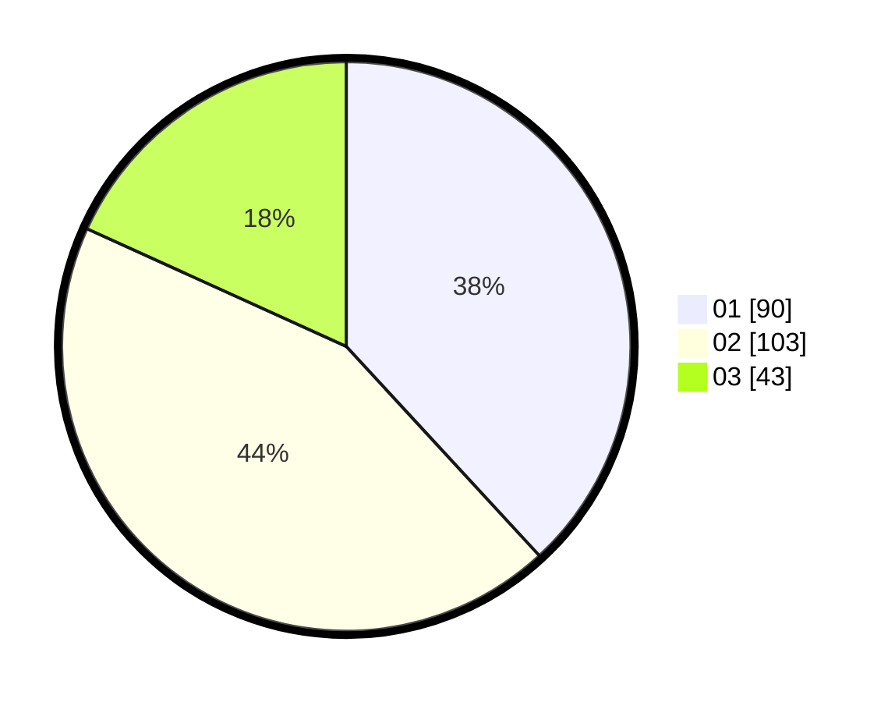

# Hasil

Hasil perolehan suara paslon dapat dilihat pada file paslon-01.txt, paslon-02.txt, dan paslon-03.txt.

Jika tidak ada, artinya data tersebut belum ada pada SIREKAP.

## Perolehan Suara

 * Paslon 01: **90**.
 * Paslon 02: **103**.
 * Paslon 03: **43**.

## Foto C Plano

https://sirekap-obj-formc.kpu.go.id/4325/pemilu/ppwp/31/74/10/10/04/3174101004016-20240214-193920--fae6d024-e0e5-4336-b485-5221bafe0d46.jpg

https://sirekap-obj-formc.kpu.go.id/4325/pemilu/ppwp/31/74/10/10/04/3174101004016-20240214-212142--e25d6f5a-bf4f-4fa8-a58a-20011db9bd4e.jpg

https://sirekap-obj-formc.kpu.go.id/4325/pemilu/ppwp/31/74/10/10/04/3174101004016-20240214-193749--af713322-6247-49d3-adec-a77956f42797.jpg

## DATA PEMILIH TETAP

Jumlah pemilih dalam DPT: **295**.
 * L: **149**.
 * P: **140**.

## DATA PENGGUNA HAK PILIH

Jumlah pengguna hak pilih dalam DPT: **235**.
 * L: **111**.
 * P: **124**.

Jumlah pengguna hak pilih dalam DPTb: **0**.
 * L: **0**.
 * P: **0**.

Jumlah pengguna hak pilih dalam DPK: **5**.
 * L: **3**.
 * P: **2**.

Jumlah pengguna hak pilih: **240**.
 * L: **114**.
 * P: **120**.

## JUMLAH SUARA SAH DAN TIDAK SAH

JUMLAH SELURUH SUARA SAH: **236**.

JUMLAH SUARA TIDAK SAH: **4**.

JUMLAH SELURUH SUARA SAH DAN SUARA TIDAK SAH: **240**.
