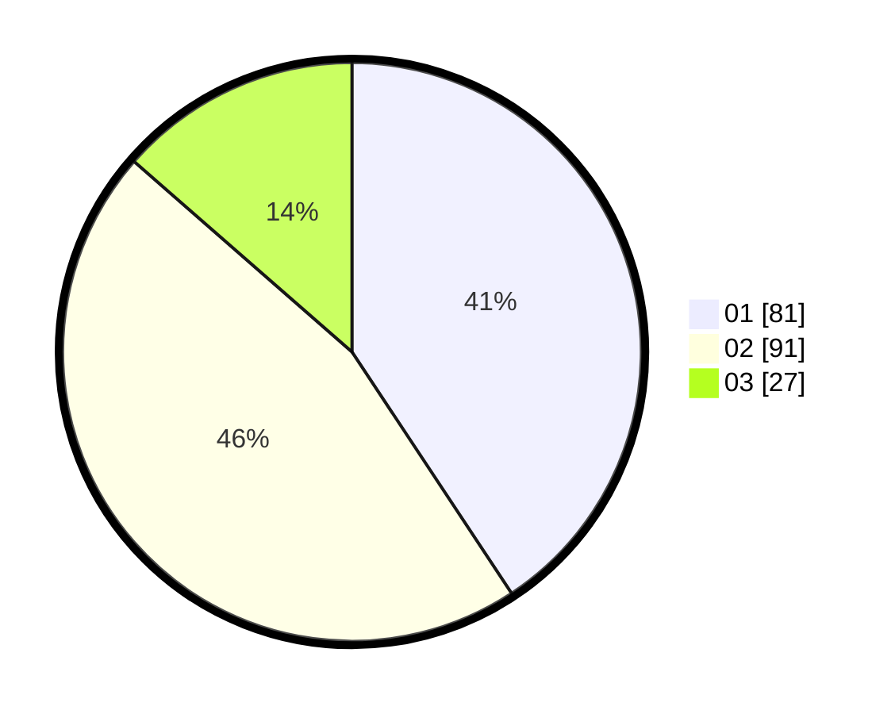

# Hasil

Hasil perolehan suara paslon dapat dilihat pada file paslon-01.txt, paslon-02.txt, dan paslon-03.txt.

Jika tidak ada, artinya data tersebut belum ada pada SIREKAP.

## Perolehan Suara

 * Paslon 01: **81**.
 * Paslon 02: **91**.
 * Paslon 03: **27**.

## Foto C Plano

https://sirekap-obj-formc.kpu.go.id/bd48/pemilu/ppwp/31/74/10/10/04/3174101004024-20240214-190241--b7612d80-09a0-42ad-854b-c07e2610b7bc.jpg

https://sirekap-obj-formc.kpu.go.id/bd48/pemilu/ppwp/31/74/10/10/04/3174101004024-20240214-193852--4c448d77-44c4-40b8-b121-59d5158f2d5c.jpg

https://sirekap-obj-formc.kpu.go.id/bd48/pemilu/ppwp/31/74/10/10/04/3174101004024-20240214-193258--4108de1d-5360-457c-b82d-6eb96985f146.jpg

## DATA PEMILIH TETAP

Jumlah pemilih dalam DPT: **270**.
 * L: **128**.
 * P: **142**.

## DATA PENGGUNA HAK PILIH

Jumlah pengguna hak pilih dalam DPT: **197**.
 * L: **91**.
 * P: **106**.

Jumlah pengguna hak pilih dalam DPTb: **0**.
 * L: **0**.
 * P: **0**.

Jumlah pengguna hak pilih dalam DPK: **4**.
 * L: **3**.
 * P: **1**.

Jumlah pengguna hak pilih: **201**.
 * L: **94**.
 * P: **107**.

## JUMLAH SUARA SAH DAN TIDAK SAH

JUMLAH SELURUH SUARA SAH: **199**.

JUMLAH SUARA TIDAK SAH: **2**.

JUMLAH SELURUH SUARA SAH DAN SUARA TIDAK SAH: **201**.
