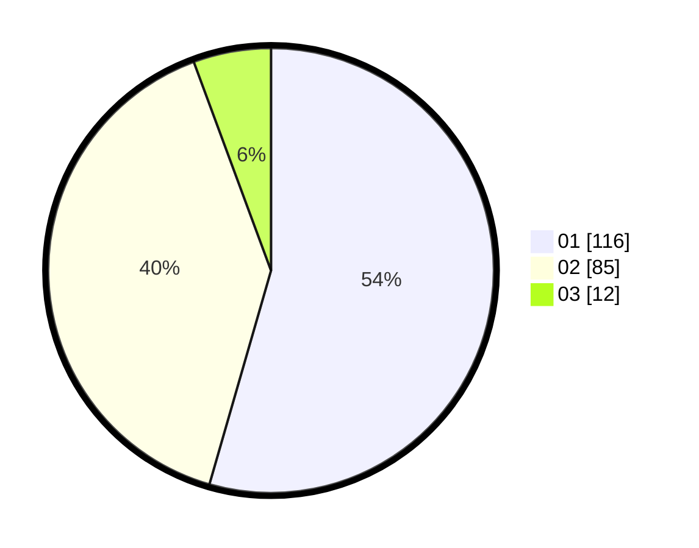

# Hasil

Hasil perolehan suara paslon dapat dilihat pada file paslon-01.txt, paslon-02.txt, dan paslon-03.txt.

Jika tidak ada, artinya data tersebut belum ada pada SIREKAP.

## Perolehan Suara

 * Paslon 01: **116**.
 * Paslon 02: **85**.
 * Paslon 03: **12**.

## Foto C Plano

https://sirekap-obj-formc.kpu.go.id/1b6a/pemilu/ppwp/31/74/10/10/04/3174101004030-20240218-165335--9256b0cc-78db-4a24-8e15-97e30630c893.jpg

https://sirekap-obj-formc.kpu.go.id/1b6a/pemilu/ppwp/31/74/10/10/04/3174101004030-20240218-165337--36e74502-f196-4ad0-b160-37a0c6ddcc58.jpg

https://sirekap-obj-formc.kpu.go.id/1b6a/pemilu/ppwp/31/74/10/10/04/3174101004030-20240218-165336--46dc6752-18b2-4e72-ae66-88fecf5545be.jpg

## DATA PEMILIH TETAP

Jumlah pemilih dalam DPT: **274**.
 * L: **138**.
 * P: **136**.

## DATA PENGGUNA HAK PILIH

Jumlah pengguna hak pilih dalam DPT: **215**.
 * L: **103**.
 * P: **112**.

Jumlah pengguna hak pilih dalam DPTb: **1**.
 * L: **0**.
 * P: **1**.

Jumlah pengguna hak pilih dalam DPK: **0**.
 * L: **0**.
 * P: **0**.

Jumlah pengguna hak pilih: **216**.
 * L: **103**.
 * P: **113**.

## JUMLAH SUARA SAH DAN TIDAK SAH

JUMLAH SELURUH SUARA SAH: **213**.

JUMLAH SUARA TIDAK SAH: **3**.

JUMLAH SELURUH SUARA SAH DAN SUARA TIDAK SAH: **216**.
