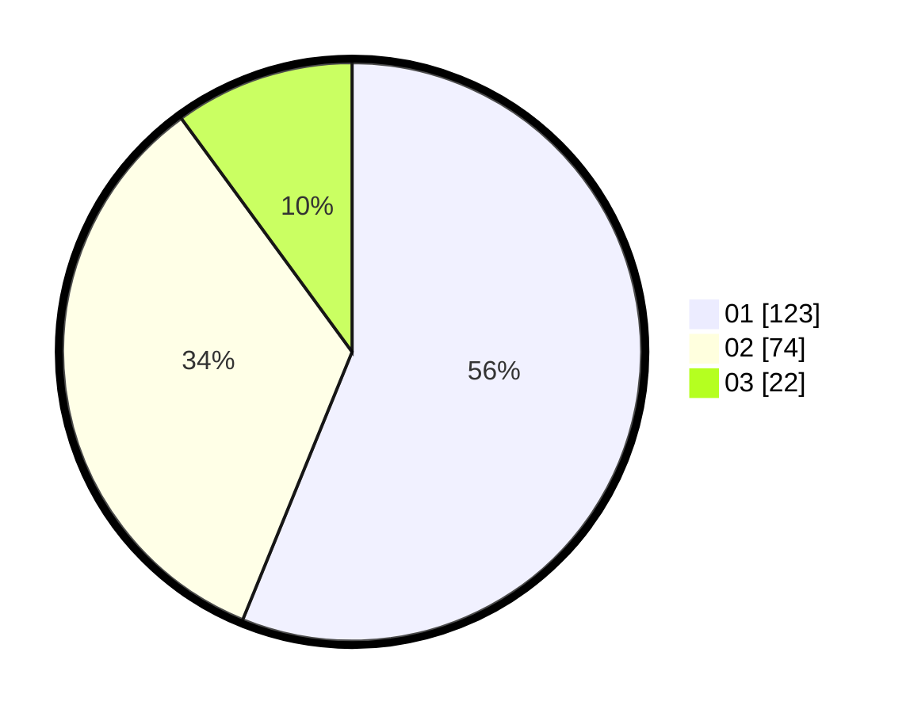

# Hasil

Hasil perolehan suara paslon dapat dilihat pada file paslon-01.txt, paslon-02.txt, dan paslon-03.txt.

Jika tidak ada, artinya data tersebut belum ada pada SIREKAP.

## Perolehan Suara

 * Paslon 01: **123**.
 * Paslon 02: **74**.
 * Paslon 03: **22**.

## Foto C Plano

https://sirekap-obj-formc.kpu.go.id/8734/pemilu/ppwp/31/74/10/10/04/3174101004042-20240215-003259--32e0de60-30f8-45a6-8e0d-7912c4910196.jpg

https://sirekap-obj-formc.kpu.go.id/8734/pemilu/ppwp/31/74/10/10/04/3174101004042-20240215-003215--faf7636d-7a5e-40a6-ba10-fe9094ed81c9.jpg

https://sirekap-obj-formc.kpu.go.id/8734/pemilu/ppwp/31/74/10/10/04/3174101004042-20240215-003104--a2a41516-1de6-4ac1-9b86-7a0fef334c2c.jpg

## DATA PEMILIH TETAP

Jumlah pemilih dalam DPT: **276**.
 * L: **130**.
 * P: **146**.

## DATA PENGGUNA HAK PILIH

Jumlah pengguna hak pilih dalam DPT: **221**.
 * L: **92**.
 * P: **129**.

Jumlah pengguna hak pilih dalam DPTb: **3**.
 * L: **2**.
 * P: **1**.

Jumlah pengguna hak pilih dalam DPK: **1**.
 * L: **1**.
 * P: **0**.

Jumlah pengguna hak pilih: **225**.
 * L: **95**.
 * P: **130**.

## JUMLAH SUARA SAH DAN TIDAK SAH

JUMLAH SELURUH SUARA SAH: **219**.

JUMLAH SUARA TIDAK SAH: **6**.

JUMLAH SELURUH SUARA SAH DAN SUARA TIDAK SAH: **225**.
