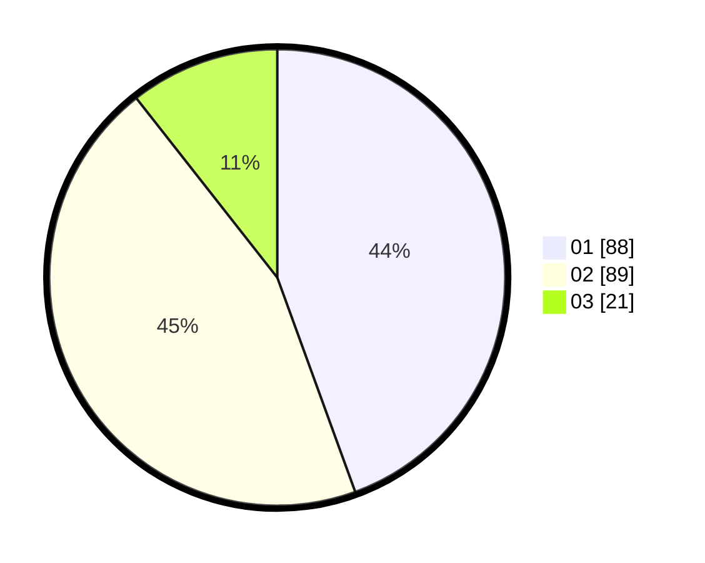

# Hasil

Hasil perolehan suara paslon dapat dilihat pada file paslon-01.txt, paslon-02.txt, dan paslon-03.txt.

Jika tidak ada, artinya data tersebut belum ada pada SIREKAP.

## Perolehan Suara

 * Paslon 01: **88**.
 * Paslon 02: **89**.
 * Paslon 03: **21**.

## Foto C Plano

https://sirekap-obj-formc.kpu.go.id/8158/pemilu/ppwp/31/74/10/10/04/3174101004046-20240215-234844--b4163824-27e7-4e1b-b2b3-cafd8aa9458c.jpg

https://sirekap-obj-formc.kpu.go.id/8158/pemilu/ppwp/31/74/10/10/04/3174101004046-20240215-234846--02d8239c-1af2-4ba3-9506-025f73e0baaa.jpg

https://sirekap-obj-formc.kpu.go.id/8158/pemilu/ppwp/31/74/10/10/04/3174101004046-20240215-234844--961a42e6-4ea5-4958-9989-88b5de216487.jpg

## DATA PEMILIH TETAP

Jumlah pemilih dalam DPT: **238**.
 * L: **115**.
 * P: **123**.

## DATA PENGGUNA HAK PILIH

Jumlah pengguna hak pilih dalam DPT: **201**.
 * L: **97**.
 * P: **104**.

Jumlah pengguna hak pilih dalam DPTb: **0**.
 * L: **0**.
 * P: **0**.

Jumlah pengguna hak pilih dalam DPK: **0**.
 * L: **0**.
 * P: **0**.

Jumlah pengguna hak pilih: **201**.
 * L: **0**.
 * P: **0**.

## JUMLAH SUARA SAH DAN TIDAK SAH

JUMLAH SELURUH SUARA SAH: **198**.

JUMLAH SUARA TIDAK SAH: **3**.

JUMLAH SELURUH SUARA SAH DAN SUARA TIDAK SAH: **201**.
