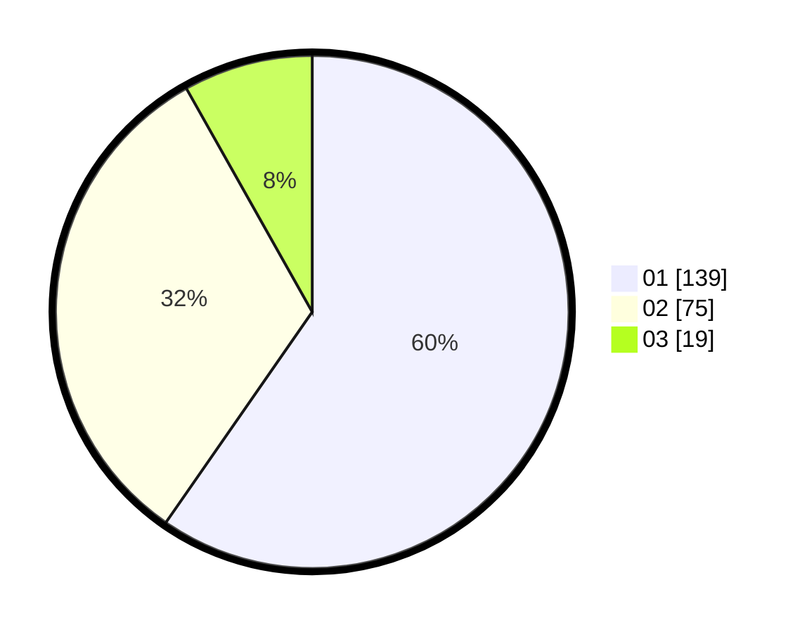

# Hasil

Hasil perolehan suara paslon dapat dilihat pada file paslon-01.txt, paslon-02.txt, dan paslon-03.txt.

Jika tidak ada, artinya data tersebut belum ada pada SIREKAP.

## Perolehan Suara

 * Paslon 01: **139**.
 * Paslon 02: **75**.
 * Paslon 03: **19**.

## Foto C Plano

https://sirekap-obj-formc.kpu.go.id/1e42/pemilu/ppwp/31/74/10/10/04/3174101004056-20240216-082717--5bfb835d-471e-4d5a-ad50-0ec8544ece59.jpg

https://sirekap-obj-formc.kpu.go.id/1e42/pemilu/ppwp/31/74/10/10/04/3174101004056-20240216-082729--15065589-ffc0-405d-b42a-4feaeb949ef8.jpg

https://sirekap-obj-formc.kpu.go.id/1e42/pemilu/ppwp/31/74/10/10/04/3174101004056-20240216-082719--bcd1e6bb-ecd2-4657-99ed-de816a54e44d.jpg

## DATA PEMILIH TETAP

Jumlah pemilih dalam DPT: **281**.
 * L: **139**.
 * P: **142**.

## DATA PENGGUNA HAK PILIH

Jumlah pengguna hak pilih dalam DPT: **226**.
 * L: **111**.
 * P: **115**.

Jumlah pengguna hak pilih dalam DPTb: **3**.
 * L: **1**.
 * P: **2**.

Jumlah pengguna hak pilih dalam DPK: **7**.
 * L: **3**.
 * P: **4**.

Jumlah pengguna hak pilih: **236**.
 * L: **115**.
 * P: **121**.

## JUMLAH SUARA SAH DAN TIDAK SAH

JUMLAH SELURUH SUARA SAH: **233**.

JUMLAH SUARA TIDAK SAH: **3**.

JUMLAH SELURUH SUARA SAH DAN SUARA TIDAK SAH: **236**.
